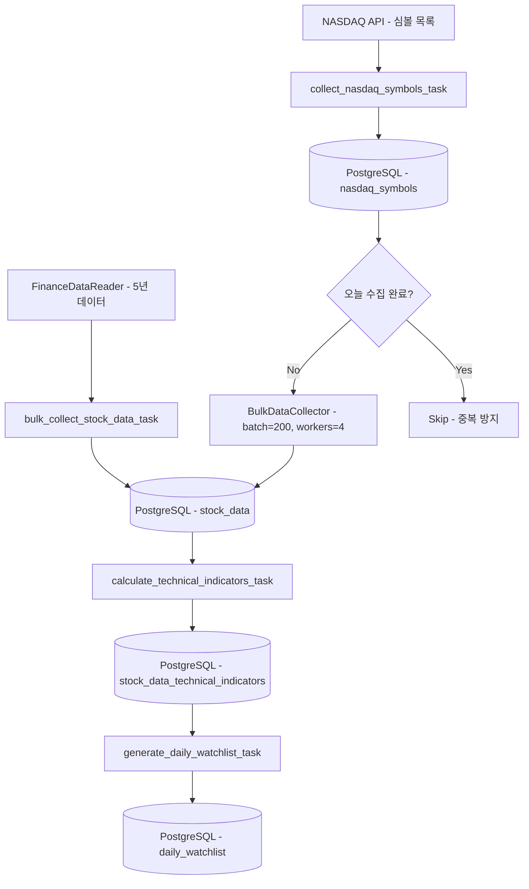
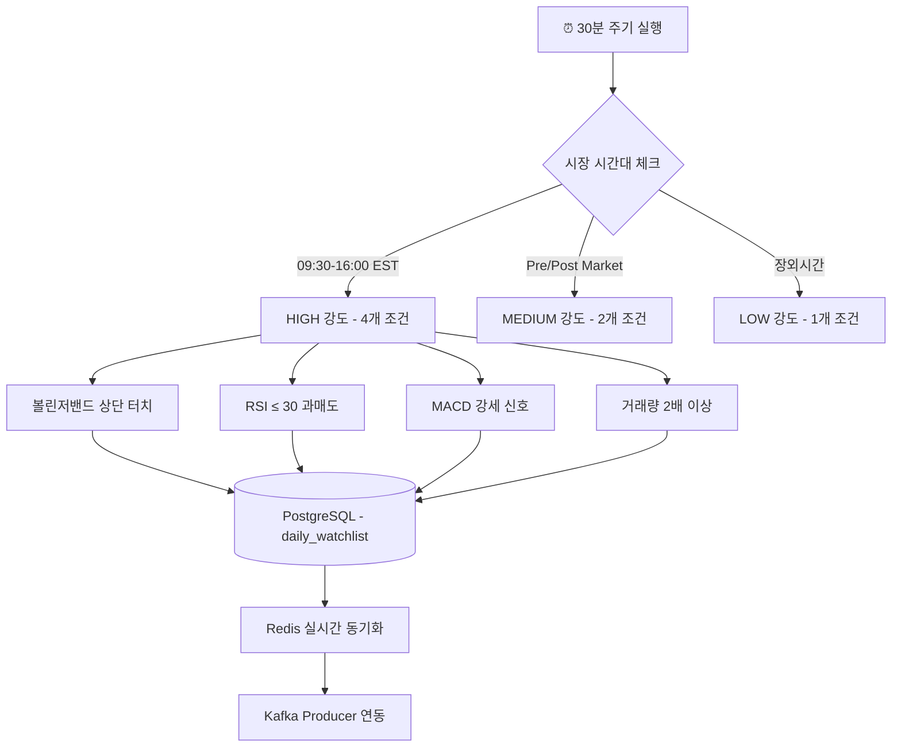

---
categories:
  - "[[Projects]]"
  - "[[Data Pipelines]]"
created: 2025-07-28
topics:
  - "[[Airflow]]"
  - "[[Data Engineering]]"
tags:
  - project
  - pipeline
  - airflow
draft: false
---

# 3. Airflow — 배치처리

Airflow는 두 개의 DAG로 배치 데이터를 수집하고 관심종목을 관리합니다.

---

## DAG 목록

| DAG | 스케줄 | 역할 |
|-----|--------|------|
| `enhanced_nasdaq_bulk_collection_postgres` | 매일 07:00 | 5년치 히스토리컬 데이터 수집 |
| `daily_watchlist_scanner_postgres` | 30분마다 (`*/30 * * * *`) | 기술적 조건 기반 관심종목 스캔 |

---

## DAG 1: 5년치 히스토리컬 데이터 수집



### 핵심 설계 전략

- **배치 크기**: 200개씩 처리 — API 제한과 메모리 효율 균형
- **병렬 처리**: `max_workers=4` 동시 API 호출
- **중복 방지**: 당일 이미 수집된 경우 Skip
- **에러 복구**: `retries=2`, `retry_delay=10분`

### 성능 지표

- 실행 시간: **90~140분**
- 처리량: **65K 레코드/배치**

---

## DAG 2: 30분 관심종목 스캐너



### 시장 시간대별 강도 조절

| 시간대 | 강도 | 활성 조건 |
|--------|------|-----------|
| 09:30~16:00 EST (장중) | HIGH | 볼린저, RSI, MACD, 거래량 4개 활성 |
| 04:00~09:30 / 16:00~20:00 EST (Pre/Post) | MEDIUM | 볼린저, 거래량 2개 활성 |
| 20:00~04:00 EST (야간) | LOW | 볼린저 1개만 활성 |

### 성능 지표

- 실행 시간: **3.5~5.5분**
- 일일 실행 횟수: **48회**

---

## 데이터 흐름 전체 요약

```
FinanceDataReader (과거 데이터)
    → stock_data (PostgreSQL)
    → stock_data_technical_indicators
    → daily_watchlist
    → Redis Cache
    → Kafka Producer (실시간 수집 대상 목록)
```
