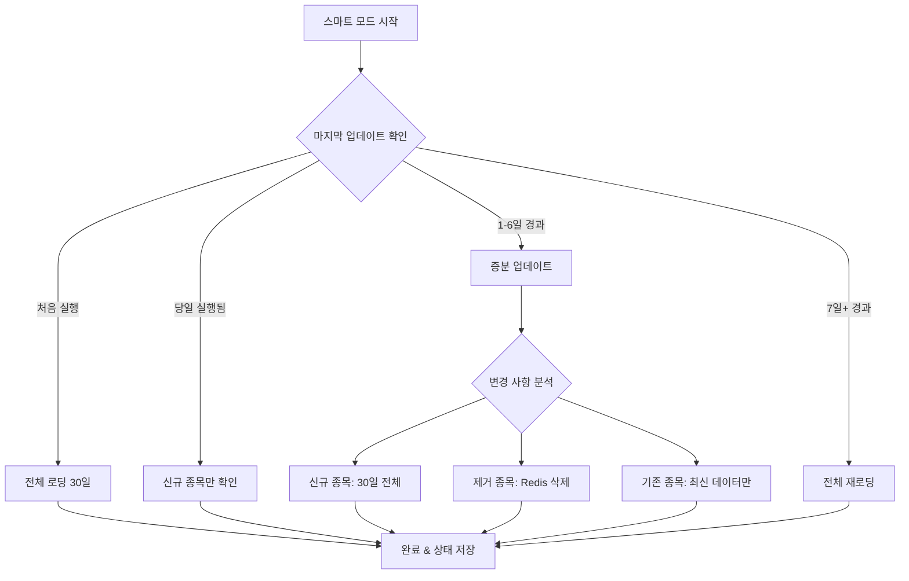

---
categories:
  - "[[Projects]]"
  - "[[Data Pipelines]]"
created: 2025-08-10
topics:
  - "[[Data Engineering]]"
  - "[[Kafka]]"
tags:
  - project
  - pipeline
draft: false
---

# Redis 데이터 관리 가이드

Redis를 활용한 고성능 관심종목 데이터 관리 및 스마트 증분 업데이트 시스템입니다.

---

## 스마트 증분 업데이트 시스템

관심종목 데이터를 효율적으로 관리하는 지능형 업데이트 시스템입니다.

### 업데이트 모드별 특징

| 모드 | 설명 | 사용 시점 | 처리 시간 | 네트워크 사용량 |
|------|------|-----------|-----------|----------------|
| `smart` | 자동 최적화 선택 | **일반적 사용** | 2-5분 | 최소 |
| `incremental` | 최근 N일만 업데이트 | 정기 업데이트 | 3-8분 | 중간 |
| `full` | 전체 재로딩 | 초기 설정 / 문제 해결 | 20-30분 | 최대 |

### 실행 명령어

```bash
# 스마트 모드 (추천)
docker compose exec airflow-scheduler python /opt/airflow/scripts/load_watchlist_to_redis.py --mode smart

# 증분 업데이트 (최근 5일)
docker compose exec airflow-scheduler python /opt/airflow/scripts/load_watchlist_to_redis.py --mode incremental --days 5

# 전체 재로딩 (60일)
docker compose exec airflow-scheduler python /opt/airflow/scripts/load_watchlist_to_redis.py --mode full --days 60

# 강제 전체 재로딩
docker compose exec airflow-scheduler python /opt/airflow/scripts/load_watchlist_to_redis.py --mode smart --force
```

Airflow DAG(`redis_watchlist_sync`)으로 매일 오전 1시 자동 실행하도록 스케줄링되어 있습니다.

---

## 지능형 판단 로직

### 스마트 모드 동작 방식



### 변경 사항 자동 분석

| 케이스 | 처리 방식 |
|--------|-----------|
| **신규 종목 감지** | 30일 전체 히스토리컬 데이터 로딩 |
| **제거 종목** | Redis에서 해당 데이터 자동 삭제 |
| **기존 종목** | 마지막 업데이트 이후 신규 일별 데이터만 추가, 최대 30일 유지 |

---

## Redis 데이터 구조

### 관심종목 데이터

```
watchlist_data:{symbol}
  └─ historical_data: [ { date, open, high, low, close, volume }, ... ]  (최대 30일)
  └─ last_updated: timestamp
  └─ trigger_price: 관심종목 등록일 종가 (장기 수익률 기준)
```

### 실시간 신호 데이터

```
signal:{symbol}
  └─ signal_type: bollinger | rsi | macd | volume
  └─ trigger_price: 신호 발생 시점 가격 (동적값)
  └─ timestamp: 신호 발생 시각
```

### 실시간 가격 데이터

```
price:{symbol}
  └─ current_price, change_rate, volume
  └─ rsi, macd, bollinger_upper, bollinger_lower
  └─ TTL: 60초
```
