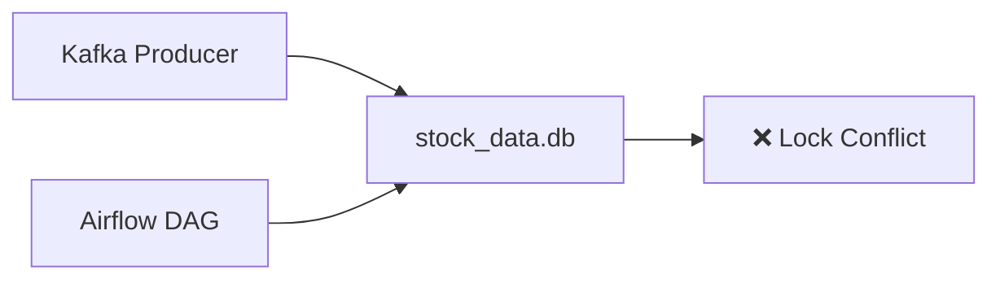

---
categories:
  - "[[Troubleshooting]]"
created: 2025-08-10
topics:
  - "[[Data Engineering]]"
tags:
  - troubleshooting
  - duckdb
  - postgresql
draft: false
---

# DuckDB 동시성 문제 — PostgreSQL 전환

## 문제 상황

프로젝트 초기에는 **DuckDB**를 메인 스토리지로 사용했습니다.
**Kafka Producer**와 **Airflow DAG**가 동시에 동일한 `stock_data.db` 파일에 접근하는 구조였는데, 이때 충돌이 발생했습니다.

### 발생한 증상

- Airflow가 쓰기 작업 중일 때 Kafka Producer의 읽기 요청이 `IOException: Cannot acquire lock`으로 거부
- Producer가 실시간 관심종목 리스트를 가져오지 못해 데이터 수집 중단
- 중간에 중단된 쓰기 작업으로 인한 불완전한 데이터 위험

---

## DuckDB의 제약

DuckDB는 In-Process 데이터베이스로 빠른 성능을 제공하지만:

- **단일 쓰기 원칙**: 한 번에 하나의 프로세스만 쓰기 가능
- **쓰기 중 읽기 차단**: 쓰기 작업 중에는 다른 프로세스의 읽기도 차단됨

---

## 임시 조치 (Read Replica 패턴)

읽기 전용 복제본을 별도로 생성하여 조회 요청을 처리했으나:

- 동기화 지연 발생
- 복제 불안정성 문제 잔존

---

## 최종 해결: PostgreSQL 전환

DuckDB를 **보조 분석용**으로만 활용하고, 메인 스토리지를 **PostgreSQL**로 전환했습니다.

PostgreSQL의 **MVCC (Multi-Version Concurrency Control)** 구조를 활용해 읽기/쓰기 동시성 문제를 근본적으로 해결했습니다.

**결과**:
- 실시간 스트리밍 데이터 적재와 동시 조회가 안정적으로 가능해짐
- API 호출 지연 모니터링과 지표 계산에 필요한 조회 응답 속도 개선
