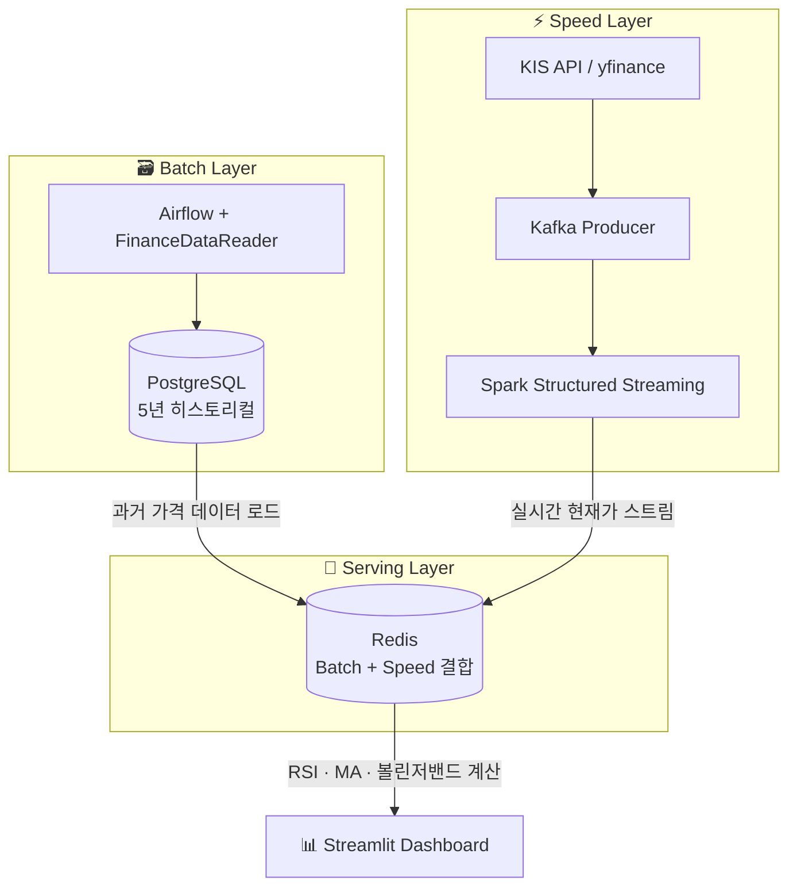

---
categories:
  - "[[Projects]]"
  - "[[Data Pipelines]]"
status: completed
stack:
  - "[[Kafka]]"
  - "[[Spark]]"
  - "[[Airflow]]"
  - "[[Docker]]"
  - "[[Python]]"
repo: https://github.com/kgeonhoe/stock-kafka3/tree/postgres
created: 2025-07-28
topics:
  - "[[Data Engineering]]"
  - "[[Data Pipelines]]"
tags:
  - project
  - pipeline
  - kafka
  - spark
  - airflow
draft: false
---
github 주소 : https://github.com/kgeonhoe/stock-kafka3

# Nasdaq Stock Data Pipeline

**Stock Kafka Pipeline**은 실시간 주식 데이터를 수집, 처리, 분석하는 통합 데이터 파이프라인입니다.
Kafka를 중심으로 한 이벤트 스트리밍 아키텍처를 통해 KIS API와 yfinance로부터 주식 데이터를 실시간으로 수집하고, Spark로 타겟 종목들의 실시간 현황을 파악합니다.

---

## 왜 Kafka를 선택했나?

- **API 호출 제약 극복** — 주식 데이터 API는 초당/분당 호출 제한이 있어, 요청 결과를 안정적으로 버퍼링하고 큐잉할 수 있는 구조가 필요했습니다.
- **실시간성 보장** — 이동평균선 돌파, 목표가 도달 등 특정 지표에 즉시 반응해야 했으므로, 배치 처리 대신 이벤트 스트리밍 기반의 실시간 처리 구조가 필요했습니다.
- **확장성 확보** — 분석 대상 종목이나 사용자 요청이 증가해도, 파티션 확장 및 컨슈머 그룹을 통해 안정적인 처리량을 유지할 수 있어야 했습니다.
- **데이터 유실 방지** — 네트워크 오류, API 응답 지연 등 다양한 장애 상황에서 데이터를 안전하게 보관하고 재처리할 수 있는 멱등성 및 내구성 있는 메시징 시스템이 필요했습니다.

---

## 아키텍처 — Lambda Architecture

이 파이프라인은 **배치 처리**와 **스트리밍 처리**를 동시에 운영하는 **람다 아키텍처(Lambda Architecture)** 를 적용했습니다.
실시간으로 이동평균선(MA), RSI, 볼린저밴드 등을 계산하려면 **당일 실시간 데이터만으로는 부족**합니다. 예를 들어 200일 이동평균선을 구하려면 과거 200일치 종가 데이터가 반드시 필요합니다. 이를 매번 스트리밍쪽에서 구현하기에는 데이터 호출제한에 걸리게 됩니다.
이를 해결하기 위해 Batch 레이어에서 축적한 히스토리컬 데이터를 Speed 레이어의 실시간 계산에 결합하는 구조를 사용합니다.

| 레이어 | 구현 | 역할 |
|--------|------|------|
| **Batch Layer** | Airflow + FinanceDataReader | 5년치 히스토리컬 데이터 축적, 기술적 지표 사전 계산 |
| **Speed Layer** | Kafka + Spark Structured Streaming | 실시간 스트리밍 처리, 당일 신규 데이터 반영 |
| **Serving Layer** | Redis + PostgreSQL | 배치 결과물 + 실시간 데이터 병합 후 조회 제공 |

---

## 데이터 소스

| 소스                            | 설명                | 용도                    |
| ----------------------------- | ----------------- | --------------------- |
| **FDR (Finance Data Reader)** | Python 라이브러리      | 과거 히스토리컬 데이터 수집       |
| **yfinance**                  | Yahoo Finance API | 당일 실시간 데이터 수집         |
| **KIS API (한국투자증권)**          | 공식 증권사 API        | 당일 실시간 데이터 수집 (1차 소스) |

### FDR을 선택한 이유

- **이동평균선 등 주요 지표 내장** — 대부분의 이동평균선(MA)이 라이브러리 수준에서 구현되어 있어, 별도의 transform 로직을 작성하지 않아도 됩니다.
-
- **배치 단계 유지보수 부담 최소화** — 배치 단계에서도 직접 API 호출로 데이터를 수집할 경우, 나스닥 외 다른 시장 데이터가 추가될 때 시장별 운영 시간대를 피한 호출 스케줄을 별도로 관리해야 하는 복잡성이 생깁니다. 파이썬 FDR라이브러리는 API 호출 제약을 없애주어, 관리 포인트를 줄여줍니다.

---

## 저장 스키마 (PostgreSQL)

### 테이블 목록

| 테이블 | 설명 |
|--------|------|
| `stock_data` | 종목별 일일 OHLCV 데이터 |
| `daily_watchlist` | Kafka Producer 실시간 수집 대상 관심종목 |
| `stock_data_technical_indicators` | RSI, MACD, 볼린저밴드 등 기술적 지표 |

---

## 컴포넌트별 상세

| 컴포넌트 | 역할 |
|----------|------|
| [[1. Kafka Producer]] | KIS API / yfinance 실시간 수집, 다중 소스 fallback 전략 |
| [[2. Kafka Consumer (Spark Structured Streaming)]] | 스트리밍 처리, 기술적 지표 계산, Redis 저장 |
| [[3. Airflow (배치처리)]] | 5년 히스토리컬 데이터 수집, 관심종목 스캔 DAG |
| [[4. Streamlit Dashboard]] | 실시간 모니터링 대시보드 |

---

## 트러블슈팅

| 제목 | 요약 |
|------|------|
| [[Trouble Shooting/DuckDB 동시성 문제]] | DuckDB → PostgreSQL 전환으로 동시 읽기/쓰기 해결 |
| [[Trouble Shooting/단일 DB vs 샤딩]] | API 병목 분석 후 단일 DB 유지 결정 |
| [[Trouble Shooting/Airflow 메모리 문제]] | Docker 메모리 제한 설정으로 OOM 해결 |

---

## 성능 테스트 결과 요약

- **Kafka 메시지 처리**: 평균 4.1ms, ~120 messages/sec, 100% 성공률
- **Airflow 5년 백필**: 90~140분, 65K 레코드/배치
- **30분 관심종목 스캔**: 3.5~5.5분, 하루 48회 실행
