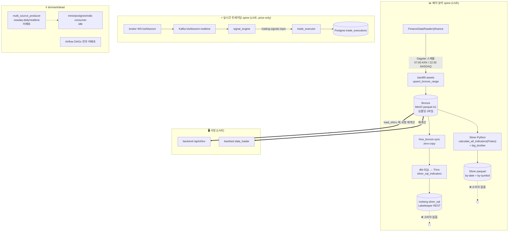

---
tags:
  - daily
draft: true
---

## Notes

```mermaid
flowchart TB
    subgraph BATCH["📊 배치 분석 spine (LIVE)"]
        FDR[FinanceDataReader/yfinance] -->|Dagster 스케줄<br/>07:00 KRX / 22:30 NASDAQ| BF[backfill assets<br/>upsert_bronze_range]
        BF --> BR[(Bronze<br/>MinIO parquet A1<br/>심볼당 1파일)]
        BR --> SP["Silver-Python<br/>calculate_all_indicators(Polars)<br/>+ big_brother"]
        BR --> HV[hive_bronze sync<br/>zero-copy] --> DBT["dbt-SQL → Trino<br/>silver_sql_indicators"]
        SP --> S1[(Silver parquet<br/>by-date + by-symbol)]
        DBT --> S2[(Iceberg silver_sql<br/>Lakekeeper REST)]
        S1 -.❌ 소비자 없음.-> X1(( ))
        S2 -.❌ 소비자 없음.-> X2(( ))
    end
    subgraph SERVE["🖥️ 서빙 (LIVE)"]
        BR ==>|load_ohlcv, 매 요청 재계산| API[backend /api/ohlcv]
        BR ==>|재계산| BT[backtest data_loader]
    end
    subgraph RT["⚡ 실시간 트레이딩 spine (LIVE, price-only)"]
        WS[broker WS kis/kiwoom] --> KT[Kafka kis/kiwoom-realtime]
        KT --> SE[signal_engine] -->|trading-signals topic| TE[trade_executor]
        TE --> PG[(Postgres trade_executions)]
    end
    subgraph DEAD["💀 dormant/dead"]
        MSP[multi_source_producer<br/>nasdaq-daily/realtime<br/>미배포] -.-> MC[minio/postgres/redis consumer<br/>idle]
        AF[Airflow DAGs 전부 미배포]
    end
```

## Tasks

- [ ]

