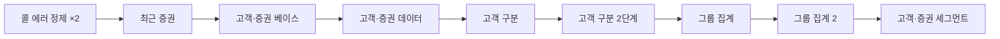
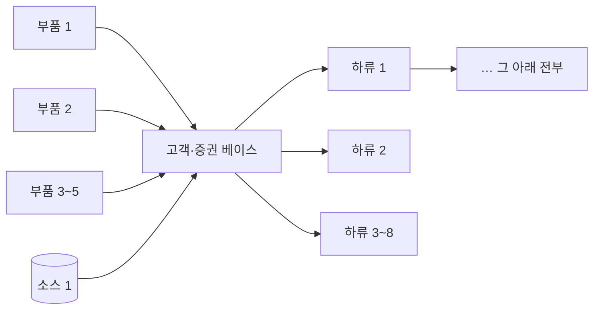
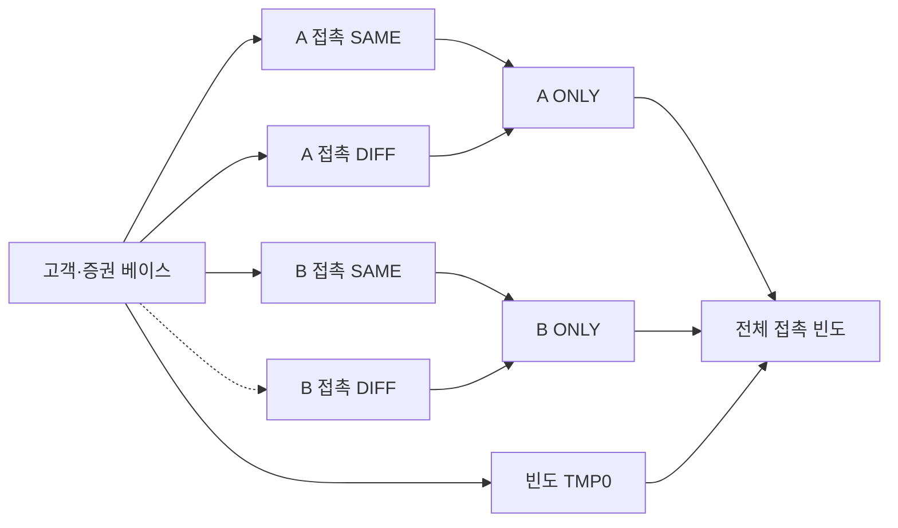
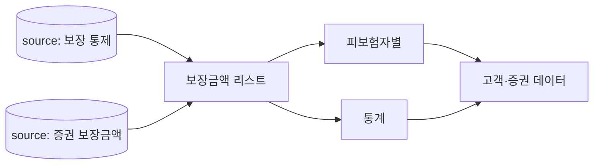

[[Projects/customer-analytics-mart/index|프로젝트 개요]]로 돌아가기

프로시저 시절 가장 답답했던 건 어떤 테이블이 어떤 테이블에 기대는지 코드를 끝까지 읽어야 알 수 있다는 점이었습니다. dbt로 옮기고 나서 얻은 것 중 하나가 이 그래프입니다. 모델이 다른 모델을 `ref()`로, 외부 테이블을 `source()`로 부르면 그 호출이 곧 의존성이라 리니지가 저절로 나옵니다. 이 글은 그 그래프를 실제로 뽑아 그려보고, 어디를 건드리면 어디까지 흔들리는지 읽은 기록입니다.

그래프는 모델 SQL 64개에서 `ref()`와 `source()` 호출을 전부 뽑아 만들고, 마지막 정상 빌드의 `manifest.json`과 대조해 맞췄습니다(모델 64개, 모델 간 엣지 64개 — 정확히 일치).

## 전체 그림

| 항목 | 값 |
|---|---|
| 모델 | 64 (부품 42, 조립 18, 기타 4) |
| 모델 → 모델 엣지 (`ref()`) | 64 |
| 소스 → 모델 엣지 (`source()`) | 27 (등록 소스 6개 전부 사용) |
| 순환 참조 | 0 |
| 가장 긴 체인 | 8단계 (모델 9개 직렬) |

흐름은 부품 → 조립 한 방향입니다. 조립 모델이 부품을 읽는 엣지가 35개, 조립끼리 22개, 부품끼리 7개이고 부품이 조립을 읽는 역방향은 0개입니다. 그래서 영향도 한 방향으로만 흐릅니다. 부품 하나를 고치면 조립 쪽으로만 번지고, 조립 모델을 고쳐도 부품은 안 흔들립니다.

## 가장 긴 줄기 — 프로시저 실행 순서가 그대로 체인이 됐다

캠페인 대상 세그먼트가 만들어지는 메인 체인입니다. 프로시저에서 `#temp`를 단계마다 넘기던 순서가 모델 9개의 직렬 체인으로 그대로 옮겨졌습니다.



이 줄기에서는 위쪽 모델의 컬럼 하나가 바뀌면 아래 8개가 순서대로 영향을 받습니다. 프로시저 때는 "어느 단계에서 뭐가 바뀌었는지" 찾으려면 코드를 위에서부터 읽어야 했는데, 이제는 그래프에서 위로 거슬러 올라가면 됩니다.

## 영향이 모이는 곳 — 허브

모델별로 "나를 참조하는 모델 수"를 세면 8회 1개, 3회 2개, 2회 3개, 1회 45개, 0회 14개입니다. 8회짜리 하나가 위 그림 가운데의 "고객·증권 베이스"입니다. 고객 한 명이 한 행인 넓은 테이블로, 부품 5개와 소스 1개를 흡수해 하류 8개에 공급합니다.



이 노드가 영향 분석의 중심입니다. 여기 컬럼 하나가 바뀌면 하류 8개와 그 아래 세그먼트·타겟까지 전부 다시 봐야 합니다. 반대로 나머지 부품 45개는 딱 한 군데서만 쓰여서, 고쳐도 영향이 그 한 곳으로 끝납니다. 재사용이 여러 곳에 고르게 있는 게 아니라 이 한 점에 몰려 있는 구조입니다. 0회인 14개 중 6개는 최종 산출물이라 정상이고 그래프의 끝점입니다. 나머지는 프로젝트 안에서 쓰이지 않거나 하드코딩으로 소비되는 것들이라 다음 절에서 같이 다룹니다.

## 그래프에서 대칭이 보이는 곳

허브 아래에 같은 모양이 나란히 두 벌 있는 구간이 있습니다. 캠페인 접촉 빈도를 집계하는 모델들입니다.



모양이 같아서 SQL을 대조해 봤더니 실제로 같은 코드였습니다.

| 쌍 | 유사도 | 실제 차이 |
|---|---|---|
| 캠페인 A의 DIFF ↔ SAME | 99.9% | 비교 연산자 1줄 (`>` vs `=`) |
| 캠페인 A SAME ↔ 캠페인 B SAME | 99.4% | 플래그 컬럼명 3줄 |
| 캠페인 A ONLY ↔ 캠페인 B ONLY | 98.9% | ref 대상 2줄 + 컬럼명 |

캠페인 구분 플래그와 비교 연산자만 다른 SQL 6개라, 파라미터 2개짜리 매크로 하나로 대체할 수 있습니다. 그래프를 그리기 전에는 파일 6개가 따로 있으니 각각 다른 로직인 줄 알기 쉬운데, 그림으로 놓고 보면 바로 보입니다. 점선 하나는 다음 절에서 다룹니다.

## 소스부터 끝까지 이어진 구간

보장금액 계열은 그래프의 시작점(소스)부터 합류점까지 끊김 없이 이어집니다. 소스 2개를 `source()`로 읽어 리스트 모델을 만들고, 피보험자별·통계 모델을 거쳐 고객·증권 데이터로 합류합니다.



이 구간에서는 "보장 통제 테이블 스키마가 바뀌면 어디까지 영향인가"라는 질문에 그래프가 바로 답합니다. 리스트 → 피보험자별·통계 → 고객·증권 데이터 → 그 아래 체인 전부. 나머지 구간도 이 모양이 목표입니다.

## 그래프가 못 보는 것

dbt는 `ref()`와 `source()`로 쓴 참조만 그래프에 넣습니다. 프로시저에서 옮겨 온 코드에는 아직 물리 테이블명을 그대로 적은 하드코딩 참조가 98곳(39개 모델) 남아 있고, 그 때문에 그래프상 부모가 없는 모델이 21개(33%)입니다. 위 접촉 빈도 그림의 점선이 그런 자리입니다. dbt 모델끼리인데 물리 테이블명으로 읽어서 dbt가 두 모델 사이의 순서를 모릅니다. 병렬 실행이면 갱신 전 데이터를 읽을 수 있습니다.

```sql
-- 이렇게 쓰면 dbt는 두 모델 사이의 의존성을 모릅니다
FROM dbo.customer_policy_base

-- 이렇게 써야 그래프에 들어가고 빌드 순서가 보장됩니다
FROM {{ ref('customer_policy_base') }}
```

외부 테이블도 마찬가지입니다. 상품 마스터는 9개 모델이, 원장 뷰 15종은 14개 모델이 하드코딩으로 읽고 있어 그래프의 시작점이 비어 있습니다. 위에서 본 영향 분석은 `ref()`/`source()`로 이어진 111곳까지만 정확하고, 나머지 98곳은 아직 코드를 읽어야 압니다. 하드코딩을 전부 `source()`/`ref()`로 바꿔 부모 없는 모델 21개를 0으로 만드는 게 다음 과제입니다.

다음: [[고객마트 개선 로드맵]]
