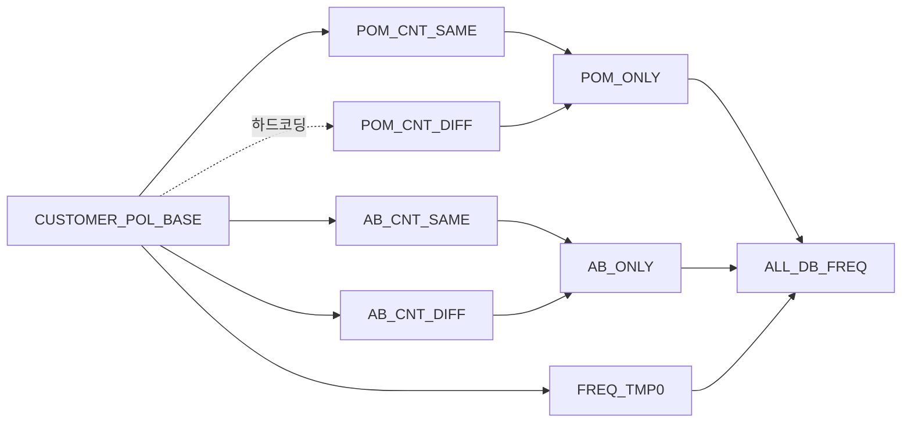
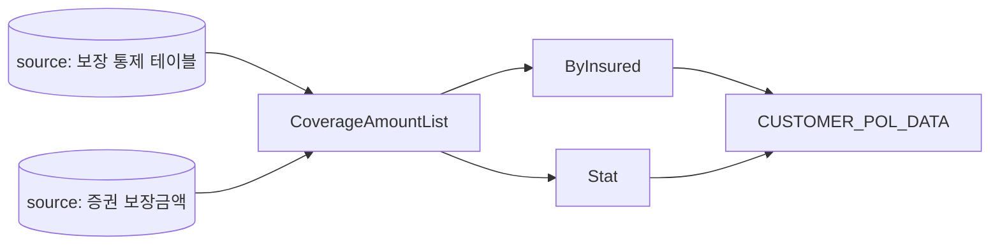

[[Projects/customer-analytics-mart/index|프로젝트 개요]]로 돌아가기

"테이블 재사용성을 고려해 잘 짜인 구조인가"를 숫자로 확인했습니다. 모든 모델 SQL에서 `ref()`/`source()` 호출을 추출하고 마지막 정상 빌드의 `manifest.json`과 교차 검증했습니다 (모델 64개, 모델 간 엣지 64개 — 정확히 일치).

## 요약 통계

| 항목 | 값 |
|---|---|
| 모델 수 | 64 (subtable 42, pom_procedure 18, 기타 4) |
| ref 엣지 | 64 (호출 81회) |
| source 엣지 | 27 (등록 소스 6개 전부 사용됨) |
| 하드코딩 참조 | 39/64 모델(61%), 고유 참조 98곳 |
| 순환 참조 | 0 |
| 최대 체인 깊이 | 8단계 (모델 9개 직렬) |
| 리니지 고아 모델 | 21/64 (33%) — 하드코딩 때문에 부모가 안 잡히는 모델 |

## 폴더 간 의존 방향 — 이건 건전하다

| from \ to | subtable | pom_procedure |
|---|---|---|
| pom_procedure | 35 | 22 |
| subtable | 7 | 0 |

subtable(부품) → pom_procedure(조립) 단방향이고 역류가 없습니다. 레이어 이름만 없을 뿐 흐름은 잡혀 있었습니다.

## 재사용성 — 별(star) 구조

피참조(fan-in) 분포: 8회×1, 3회×2, 2회×3, 1회×45, 0회×14.

| 순위 | 모델 | 피참조 |
|---|---|---|
| 1 | POMSUB_CUSTOMER_POL_BASE | 8 (+숨은 엣지 1 = 실질 9) |
| 2 | POMSUB_ContractStat | 3 |
| 2 | POMSUB_MATURITYREFUNDPOLICY | 3 |
| 4 | POMSUB_RECENT_POLICYNO 외 2개 | 2 |

재사용이 사실상 허브 모델 하나에 집중되어 있습니다. 증권 그레인 와이드 테이블(201줄)이 부품 5개 + 소스 1개를 흡수해 하류 8개에 공급하는 구조입니다. 재사용성이 "있다"기보다 "한 점에 있다"가 정확합니다 — 허브가 바뀌면 하류 전체가 흔들리고 반대로 부품 45개는 한 번씩만 쓰이는 1회성입니다.

0회 재사용 14개 중 6개는 최종 산출물(정상), 4개는 프로젝트 내 미사용 — 외부에서 직접 조회하거나 dead 후보입니다. 2개는 스크래치 잔재입니다. 나머지 2개가 문제인데, 표면상 리프처럼 보이지만 실제로는 하드코딩으로 소비되고 있었습니다.

## 숨은 엣지 — dbt가 빌드 순서를 보장하지 못하는 지점

dbt 모델끼리인데 `ref()` 대신 물리 테이블명으로 참조하는 곳이 3건 확정, 1건 오타 의심으로 나왔습니다.

1. FREQ 계열의 DIFF 버전 모델 → 허브 모델을 하드코딩 참조. manifest에서 `depends_on: []`로 확인됐습니다. **ephemeral 모델인데 상류 의존이 통째로 누락** — 쌍둥이인 SAME 버전은 `ref()`를 정확히 쓰고 있어서 명백한 회귀입니다.
2. WEL 타겟 F 모델 → WEL 타겟 모델 하드코딩.
3. WEL 사전 캠페인 모델 → 최근 캠페인 일자 모델 하드코딩.
4. (의심) 보장금액 리스트 참조에 `Converage`라는 철자로 된 테이블명 — 레거시 물리 테이블이거나 오타.

이 지점들은 병렬 실행(threads: 4)에서 갱신 전 데이터를 읽을 수 있습니다. `ref()` 한 줄 수정으로 닫히는 정합성 구멍이라 우선순위 1번입니다.

## 중복 SQL 군 — 매크로화 1순위

FREQ 계열 6개 모델을 정규화 후 유사도 비교했습니다.

| 쌍 | 유사도 | 실제 차이 |
|---|---|---|
| AB계열 DIFF ↔ SAME | 99.9% | 비교 연산자 1줄 (`>` vs `=`) |
| AB SAME ↔ POM SAME | 99.4% | 플래그 컬럼명 3줄 |
| AB ONLY ↔ POM ONLY | 98.9% | ref 대상 2줄 + 컬럼명 |

플래그 컬럼(캠페인 구분)과 비교 연산자만 다른 동일 SQL입니다. 파라미터 2개짜리 매크로 1개로 6개 파일을 대체할 수 있습니다. 클레임 플래그 2종(72% 유사)도 공통 중간 모델 분리 여지가 있습니다.

## 대표 리니지

고객-증권 세그먼트 메인 체인 — 프로시저의 단계 실행이 그대로 모델 직렬 체인이 된 모습:

FREQ 집계 — 중복 6종이 모이는 지점 (점선 = 하드코딩 숨은 엣지):

보장금액 계열 — source부터 ref까지 일관된 모범 구간도 있습니다:

## 소스 계약 상태

- 등록 소스 6개 중 freshness 설정은 1개뿐 (최상류 스냅샷 뷰 — warn 1일/error 5일, 이건 모범)
- 이미 소스로 등록된 테이블을 `source()` 대신 하드코딩으로 참조하는 모델 6개 — 등록만 하고 안 쓰는 상태
- 미등록 외부 테이블 다수: 상품 마스터(9개 모델에서 하드코딩), 원장 뷰 15종(링크드 서버 경유, 14개 모델 사용) — 전부 freshness 사각지대. 이 중 `[MIS].ACEINA`(기간계) 원장 뷰를 참조하는 12개 모델은 freshness 미설정 정도가 아니라 `campmonth` 필터 자체가 11개 모델에 없어, 등록해도 스냅샷 개념이 성립하지 않는 실시간 원장입니다 ([[고객마트 dbt 구조 진단]] 참조)

materialization 분포는 table 53, ephemeral 9, 기본값 view 2. 62개가 인라인 config라서 프로젝트 설정과 이중 관리 상태입니다.

## 우선 조치 (효과순)

1. 숨은 엣지 3건 `ref()` 전환 — 한 줄짜리 수정으로 정합성 구멍이 닫힙니다
2. dbt_project.yml YAML 문법 수정 ([[고객마트 dbt 구조 진단]] 참조)
3. FREQ 계열 6개 매크로화
4. 등록 소스 하드코딩 6건 `source()` 전환 + 다빈도 외부 테이블 소스 등록
5. 스크래치 2개와 미사용 리프 4개 소비처 확인 후 정리

다음: [[고객마트 개선 로드맵]]
