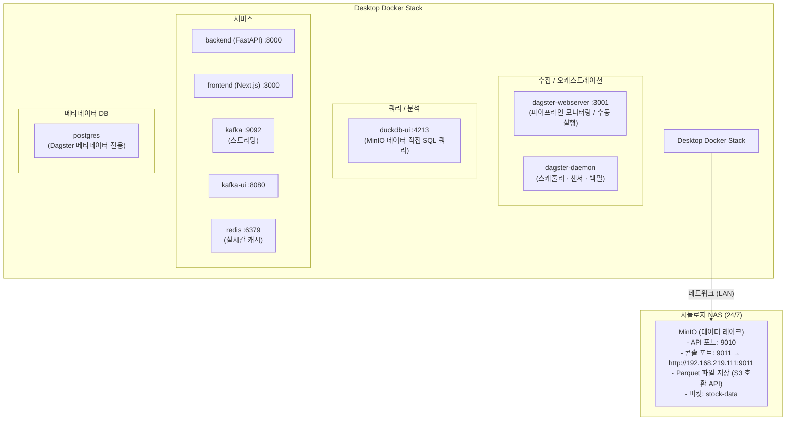
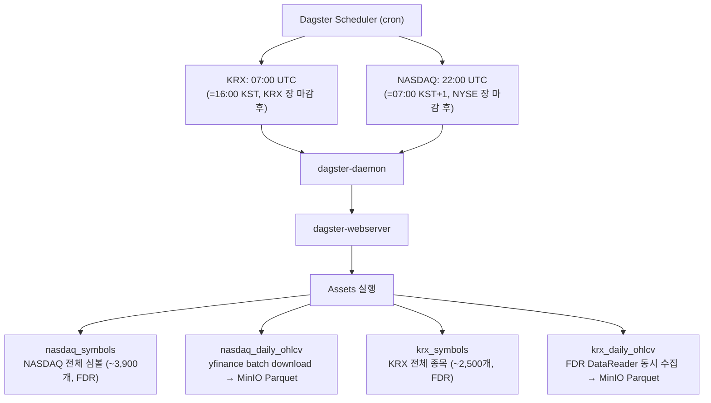
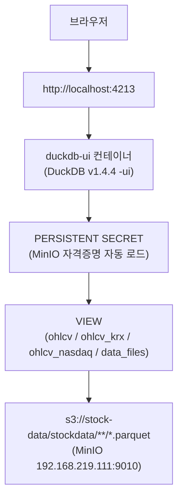
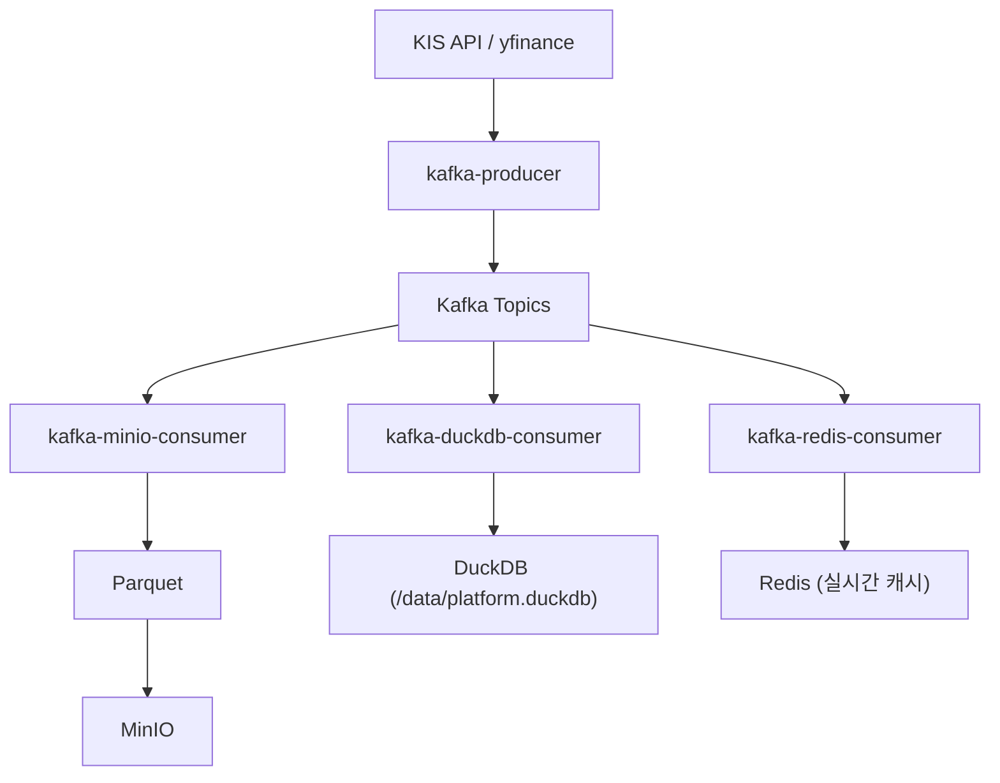

# stock-platform 시스템 아키텍처

> **최종 업데이트**: 2026-06-01  
> **프로젝트**: stock-platform

---

## 📐 전체 시스템 구조



---

## 🗂️ 데이터 플로우

### 배치 수집 파이프라인 (Dagster)



### 쿼리 플로우 (DuckDB UI)



### 실시간 파이프라인 (Kafka)



---

## 💾 스토리지 구조

### MinIO Parquet 경로 (Medallion Architecture)

```
stock-data/stockdata/
│
├── bronze/                                              ← Raw OHLCV
│   └── exchange={EX}/symbol={SYM}/ohlcv.parquet
│
├── silver/                                              ← 지표 적용 (스크리닝용, 날짜 파티션)
│   └── exchange={EX}/date={DATE}/data.parquet
│       └── 전체 심볼 × 30+ 지표 컬럼 (파일 1개/날짜)
│
└── silver_by_symbol/                                    ← 지표 적용 (백테스팅/차트용, 심볼 파티션)
    └── exchange={EX}/symbol={SYM}/indicators.parquet
        └── 전체 기간 × 30+ 지표 컬럼 (파일 1개/심볼)
```

#### 조회 패턴별 경로 선택

| 목적 | 사용 경로 |
|---|---|
| 스크리닝 (특정 날짜 전체 종목 비교) | `silver/exchange={EX}/date={DATE}/` |
| 백테스팅 / 차트 (특정 종목 전체 기간) | `silver_by_symbol/exchange={EX}/symbol={SYM}/` |

> 상세 설계 이유: [`docs/silver-symbol-query-performance.md`](silver-symbol-query-performance.md)

**Bronze 컬럼 스키마**: `symbol, date, open, high, low, close, volume, exchange`

> - KRX 가격: BIGINT (원화 정수)  
> - NASDAQ 가격: DOUBLE (yfinance float)  
> - DuckDB VIEW에서 `CAST(... AS DOUBLE)` + `union_by_name=true` 로 통합

### DuckDB 파일 (플랫폼 메타)

**위치**: `/data/platform.duckdb` (Docker 볼륨 `duckdb-data`)  
**저장 데이터**: 포트폴리오, 드로잉, 거래 신호, 백테스트 기록

---

## 🖥️ DuckDB UI (MinIO 쿼리 환경)

### 구성

| 항목 | 내용 |
|------|------|
| Docker 서비스 | `duckdb-ui` (docker-compose.yml) |
| 이미지 | `debian:bookworm-slim` + DuckDB CLI v1.4.4 |
| 포트 | **4213** → http://localhost:4213 |
| 접속 방법 | `docker compose up -d duckdb-ui` |
| 데이터베이스 | 컨테이너 내 `stock.duckdb` (뷰 + 시크릿 포함) |

### 파일 구조

```
stock-platform/
├── duckdb_ui/
│   ├── setup.sql       ← MinIO SECRET + VIEW 정의 (핵심)
│   ├── stock.duckdb    ← 초기화된 DB (Dockerfile이 빌드 시 생성)
│   ├── start_ui.ps1    ← Windows 로컬 실행용 런처
│   └── README.md       ← 상세 사용법
└── docker/
    └── Dockerfile.duckdb-ui
```

### 사용 가능한 VIEW

| VIEW | 설명 |
|------|------|
| `ohlcv` | 전체 OHLCV (KRX + NASDAQ, 스키마 자동 통합) |
| `ohlcv_krx` | KRX 전용 |
| `ohlcv_nasdaq` | NASDAQ 전용 |
| `data_files` | MinIO Parquet 파일 목록 |

### 주요 쿼리 예시

```sql
-- 거래소별 현황
SELECT exchange, count(*) AS rows, count(DISTINCT symbol) AS symbols
FROM ohlcv GROUP BY exchange;

-- 특정 종목 시계열
SELECT date, open, high, low, close, volume
FROM ohlcv WHERE symbol = '005930' ORDER BY date;

-- 거래대금 상위 (NASDAQ)
SELECT symbol, close, volume, ROUND(close * volume / 1e9, 2) AS turnover_B
FROM ohlcv_nasdaq ORDER BY close * volume DESC LIMIT 20;

-- 날짜별 수집 현황
SELECT year, month, day, exchange, count(DISTINCT symbol) AS symbols
FROM ohlcv GROUP BY year, month, day, exchange ORDER BY year, month, day;
```

### 기술 메모

- `PERSISTENT SECRET` → `~/.duckdb/stored_secrets/` (컨테이너 내 `/root/.duckdb/`)
- `hive_types = {'year': INTEGER, 'month': VARCHAR, 'day': VARCHAR}` 로 파티션 타입 고정
- `union_by_name = true` + `CAST(... AS DOUBLE)` 로 KRX(BIGINT)/NASDAQ(DOUBLE) 혼합 처리
- 새 데이터 추가 시 VIEW 재설정 불필요 (glob 패턴이 자동으로 신규 파일 인식)

---

## 🔌 포트 맵

| 서비스 | 포트 | 용도 |
|--------|------|------|
| frontend | 3000 | Next.js UI |
| dagster-webserver | 3001 | Dagster 파이프라인 모니터링 |
| **duckdb-ui** | **4213** | **MinIO 데이터 SQL 쿼리** |
| backend | 8000 | FastAPI |
| kafka-ui | 8080 | Kafka 토픽 모니터링 |
| kafka | 9092 | Kafka 브로커 |
| redis | 6379 | 실시간 캐시 |
| MinIO API | 9010 | S3 호환 API (NAS) |
| MinIO 콘솔 | 9011 | 웹 콘솔 (NAS) |

---

## ⚙️ Dagster 파이프라인

### Assets

| Asset | Group | 설명 |
|-------|-------|------|
| `nasdaq_symbols` | metadata | NASDAQ 전체 심볼 목록 (FDR) |
| `nasdaq_daily_ohlcv` | stock_data | NASDAQ OHLCV (yfinance batch, 100개/배치) |
| `krx_symbols` | metadata | KRX 전체 종목코드 (FDR) |
| `krx_daily_ohlcv` | stock_data_kr | KRX OHLCV (FDR, 10 workers 동시 수집) |
| `technical_indicators` | technical_analysis | RSI, MACD, SMA 등 |
| `trading_signals` | signals | BUY/SELL/HOLD 신호 |

### Jobs & Schedules

| Job | 스케줄 | 설명 |
|-----|--------|------|
| `krx_only_collection` | 07:00 UTC (월~금) | KRX 장 마감 후 수집 |
| `nasdaq_only_collection` | 22:00 UTC (월~금) | NASDAQ 장 마감 후 수집 |
| `daily_collection` | 23:00 UTC (월~금) | 전체 파이프라인 |
| `indicators_only` | 수동 | 지표 재계산 |
| `signals_only` | 수동 | 신호 재생성 |

### 파티션

- `DailyPartitionsDefinition(start_date="2024-01-01")`
- 날짜 키: `YYYY-MM-DD`
- 백필: Dagster UI → Backfill 메뉴에서 날짜 범위 선택

---

## 🔧 Docker 서비스 실행

```powershell
cd stock-platform\docker

# 전체 스택
docker compose up -d

# Dagster만
docker compose up -d dagster-webserver dagster-daemon

# DuckDB UI만
docker compose up -d duckdb-ui

# 이미지 재빌드 (코드 변경 후)
docker compose build dagster-webserver dagster-daemon
docker compose up -d dagster-webserver dagster-daemon
```

### DuckDB UI 재초기화 (setup.sql 변경 시)

```powershell
# Docker 서비스 재빌드
docker compose build duckdb-ui
docker compose up -d duckdb-ui

# 또는 로컬에서 직접 초기화 (Python duckdb>=1.4)
cd stock-platform\duckdb_ui
Remove-Item stock.duckdb -ErrorAction SilentlyContinue
python -c "
import duckdb
con = duckdb.connect('stock.duckdb')
con.execute('INSTALL httpfs'); con.execute('LOAD httpfs')
# ... setup.sql 내용 실행
con.close()
"
```

---

## 🔐 접속 정보

### MinIO (시놀로지 NAS)

| 항목 | 값 |
|------|----|
| Endpoint | `192.168.219.111:9010` |
| Access Key | `.env 참조` |
| Secret Key | `.env 참조` |
| Bucket | `stock-data` |

### Dagster

| 항목 | 값 |
|------|----|
| UI | http://localhost:3001 |

### DuckDB UI

| 항목 | 값 |
|------|----|
| UI | http://localhost:4213 |

---

## 📦 이관 전략

### Phase 1 – 현재 (Desktop)
- Docker Compose로 전체 스택 실행
- 시놀로지 MinIO 원격 연결
- 빠른 개발/테스트

### Phase 2 – 서버 이관 (예정)
1. 서버에서 코드 clone
2. `.env` 설정 (MinIO 엔드포인트 동일)
3. `docker compose up -d`
4. 데이터는 시놀로지 MinIO에서 자동 접근

---

*이 문서는 실제 구성과 동기화하여 관리합니다.*
