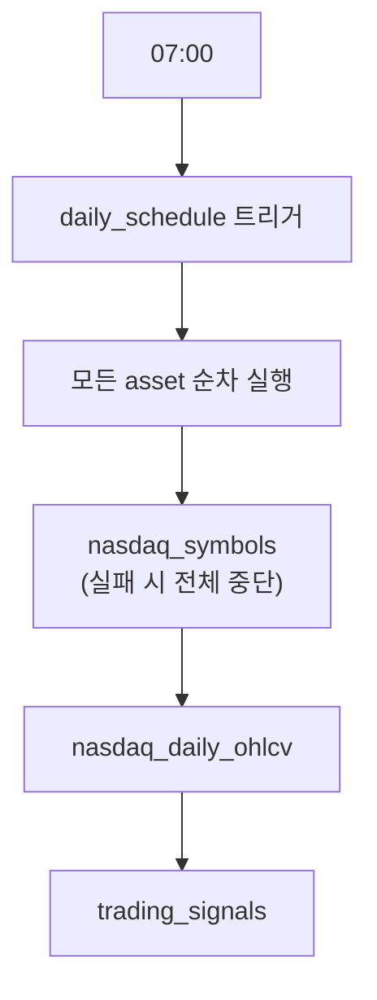
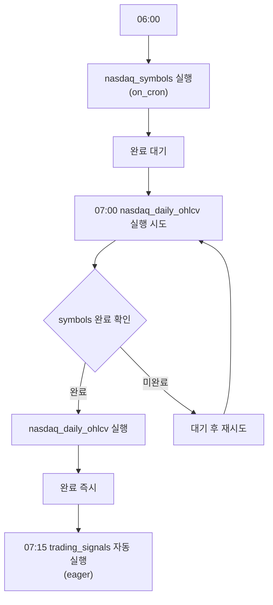
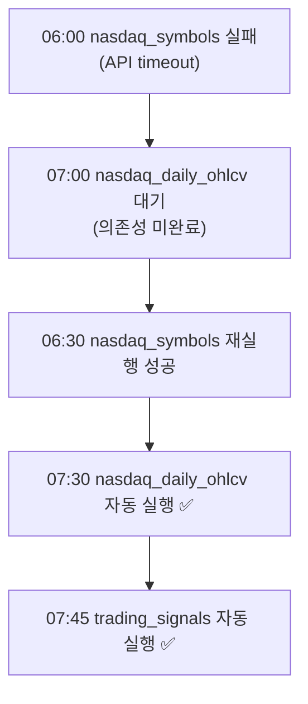

# Dagster Automation 가이드

## 📚 **개요**

Dagster에서 asset을 자동으로 실행하는 방법에는 크게 3가지가 있습니다:

1. **Schedule** (전통적 방식) - 현재 사용 중 ✅
2. **Sensor** (이벤트 기반)
3. **Declarative Automation** (조건 기반) - Dagster 1.6.0+ 필요

---

## 🔧 **현재 구현: Schedule 기반**

### 코드 (`dagster_assets/__init__.py`)

```python
from dagster import (
    Definitions,
    load_assets_from_modules,
    define_asset_job,
    ScheduleDefinition,
)

# Job 정의: 모든 asset 실행
daily_collection_job = define_asset_job(
    name="daily_collection",
    selection="*",  # 모든 asset
    description="일별 NASDAQ 데이터 수집",
)

# 스케줄: 매일 UTC 07:00
daily_schedule = ScheduleDefinition(
    job=daily_collection_job,
    cron_schedule="0 7 * * *",
    execution_timezone="UTC",
)

defs = Definitions(
    assets=all_assets,
    jobs=[daily_collection_job],
    schedules=[daily_schedule],
)
```

### 장점
- ✅ **간단명확**: 설정이 직관적
- ✅ **안정적**: 오랫동안 검증된 방식
- ✅ **예측 가능**: 정해진 시간에만 실행

### 단점
- ❌ **의존성 무시**: 상위 asset이 실패해도 실행 시도
- ❌ **수동 재시도**: 실패 시 수동으로 재실행 필요
- ❌ **고정 시간**: 데이터 준비 시간과 무관하게 실행

---

## 🚀 **Declarative Automation (추천, 1.6.0+)**

### AutomationCondition 종류

| Condition | 동작 | 사용 시나리오 |
|-----------|------|---------------|
| `on_cron(schedule)` | Cron 시간 + 의존성 완료 시 실행 | 정기 수집 (매일, 매시간) |
| `eager()` | 상위 asset 완료 즉시 실행 | 실시간 파이프라인 |
| `on_missing()` | 누락된 파티션 자동 backfill | 과거 데이터 보완 |
| 조합 (OR, AND) | 여러 조건 결합 | 복잡한 실행 로직 |

### 개선된 코드 예시

```python
from dagster import asset, AutomationCondition

# 1. 심볼 목록: 매일 06:00에 업데이트
@asset(
    automation_condition=AutomationCondition.on_cron("0 6 * * *"),
)
def nasdaq_symbols() -> List[str]:
    return get_nasdaq_symbols()


# 2. OHLCV 데이터: 07:00에 실행 (symbols 완료 후)
@asset(
    partitions_def=daily_partitions,
    automation_condition=AutomationCondition.on_cron("0 7 * * *"),
)
def nasdaq_daily_ohlcv(
    nasdaq_symbols: List[str]  # 의존성 자동 인식
) -> pd.DataFrame:
    return collect_ohlcv(nasdaq_symbols)


# 3. 거래 신호: ohlcv 완료되면 즉시 실행
@asset(
    partitions_def=daily_partitions,
    automation_condition=AutomationCondition.eager(),
)
def trading_signals(
    nasdaq_daily_ohlcv: pd.DataFrame
) -> pd.DataFrame:
    return generate_signals(nasdaq_daily_ohlcv)
```

### 실행 흐름 비교

**Schedule 방식 (현재):**


**Declarative Automation 방식:**


**실패 시 자동 복구:**


### 고급 조건 조합

```python
# 매일 07:00 OR 파티션 누락 시 실행
@asset(
    automation_condition=(
        AutomationCondition.on_cron("0 7 * * *")
        | AutomationCondition.on_missing()
    )
)
def nasdaq_daily_ohlcv(...):
    ...


# 상위 완료 AND 평일만 실행
@asset(
    automation_condition=(
        AutomationCondition.eager()
        & AutomationCondition.on_cron("0 * * * 1-5")  # 월-금
    )
)
def trading_signals(...):
    ...
```

---

## 🔄 **Sensor 기반 (이벤트 트리거)**

외부 이벤트(파일 생성, API 호출, 메시지 큐)에 반응하여 실행.

```python
from dagster import sensor, RunRequest

@sensor(job=daily_collection_job)
def s3_file_sensor(context):
    """S3에 새 파일이 생성되면 실행"""
    new_files = check_s3_for_new_files()
    
    if new_files:
        yield RunRequest(
            run_key=f"s3_{new_files[0]}",
            run_config={...}
        )
```

**사용 시나리오:**
- MinIO/S3에 새 파일 생성 시
- Kafka 메시지 수신 시
- 외부 API 이벤트 시

---

## 📊 **방식별 비교표**

| 항목 | Schedule | Sensor | Declarative Automation |
|------|----------|--------|------------------------|
| **버전 요구사항** | 모든 버전 | 모든 버전 | 1.6.0+ |
| **학습 곡선** | 낮음 | 중간 | 낮음 |
| **의존성 관리** | 수동 | 수동 | 자동 ✅ |
| **실패 복구** | 수동 | 수동 | 자동 ✅ |
| **실행 시점** | 고정 시간 | 이벤트 발생 | 조건 만족 시 |
| **코드 복잡도** | 중간 | 높음 | 낮음 ✅ |
| **디버깅** | 쉬움 | 중간 | 쉬움 |

---

## 🎯 **프로젝트에 적용한 이유**

### 현재: Schedule 사용

**선택 이유:**
1. **버전 호환성**: Dagster 1.5.13에서 AutomationCondition 미지원
2. **안정성 우선**: 검증된 방식으로 운영 시작
3. **단순 요구사항**: 매일 정해진 시간에 실행하면 충분

**트레이드오프:**
- 의존성 자동 관리 포기
- 실패 시 수동 재실행 필요
- 하지만 운영 안정성 확보 ✅

### 향후: Declarative Automation 전환 계획

**전환 시기:** Dagster 1.6.0+ 업그레이드 후

**기대 효과:**
1. **자동 복구**: nasdaq_symbols 실패 → 재실행 성공 → 하위 asset 자동 실행
2. **유연한 스케줄**: 데이터 준비되면 즉시 실행 (07:00 고정 X)
3. **파티션 관리**: 누락 파티션 자동 backfill
4. **코드 단순화**: Job, Schedule 정의 불필요

**마이그레이션 단계:**
```python
# 1단계: automation_condition 추가 (Schedule 유지)
@asset(
    automation_condition=AutomationCondition.on_cron("0 7 * * *"),
)
def nasdaq_daily_ohlcv(...):
    ...

# 2단계: __init__.py에서 Schedule 제거
defs = Definitions(
    assets=all_assets,
    # jobs, schedules 제거
)

# 3단계: UI에서 default_automation_condition_sensor 활성화
# Automation 탭 → Toggle ON
```

---

## 🛠️ **실전 팁**

### Daemon 필수!
```yaml
# docker-compose.yml
dagster-daemon:  # Scheduler 실행을 위해 필수
  command: ["dagster-daemon", "run", "-w", "dagster_assets/workspace.yaml"]
```

### 테스트 방법
```python
from dagster import evaluate_automation_conditions

# 조건 테스트 (로컬)
result = evaluate_automation_conditions(
    assets=[nasdaq_daily_ohlcv],
    cursor="2024-01-15",
)
print(result)
```

### 모니터링
- Dagster UI → **Automation** 탭
- Sensor 상태 확인 (`default_automation_condition_sensor`)
- Daemon 헬스체크 (heartbeat 확인)

---

## 📖 **참고 자료**

- [Dagster Declarative Automation 공식 문서](https://docs.dagster.io/guides/automate/declarative-automation)
- [AutomationCondition API](https://docs.dagster.io/api/dagster/assets#dagster.AutomationCondition)
- [Schedules vs Sensors vs Automation](https://docs.dagster.io/guides/automate)

---

**작성일**: 2026-05-31  
**프로젝트**: stock-platform  
**Dagster 버전**: 1.5.13 (현재) → 1.6.0+ (목표)
