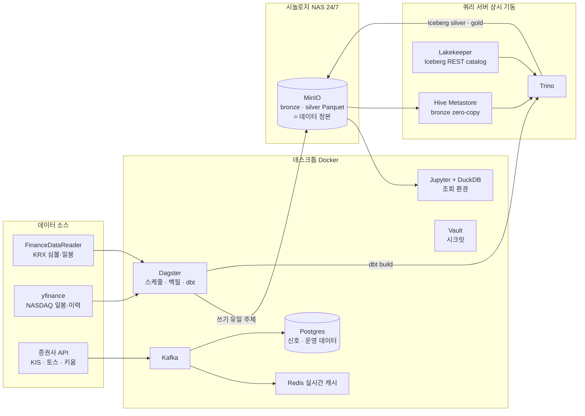

## 이 프로젝트는

KRX와 NASDAQ 전 종목(약 6,700개)의 일봉을 매일 수집해 기술적 지표를 계산하고, 스크리닝·백테스팅·매매 신호에 쓰는 개인 데이터 플랫폼이다. 클라우드 없이 집 안의 장비 — 시놀로지 NAS, 개발 데스크톱, 쿼리 전용 PC 한 대 — 로 돌아간다.

이 시리즈는 그 플랫폼을 만들면서 했던 **엔지니어링 의사결정의 기록**이다. 기술 소개가 아니라, 각 선택의 앞에 있었던 문제와 제약, 검토했다 버린 대안, 그리고 실측 수치로 확인한 결과를 남긴다. 실패와 사고도 그대로 쓴다 — 수년치 데이터를 지운 실행 한 번, 하루 만에 뒤집은 아키텍처, "완료"라고 믿었는데 한 번도 배선된 적 없던 파이프라인 같은 것들이 사실 이 시리즈의 본체다.

## 전체 구조

각 구성 요소의 책임은 한 줄씩만 요약하면 이렇다. 수집과 오케스트레이션은 Dagster가, 데이터의 정본은 NAS의 MinIO Parquet가(쓰기는 Dagster만), SQL 변환과 durable한 산출물은 별도 PC의 Trino + Iceberg가, 지표 계산은 Python/Polars가, 임시 조회는 Jupyter의 DuckDB가 맡는다. 실패 지점과 복구 방식은 각 세부 글에서 다룬다.

## 읽는 순서

시간 순이자 의존 순이다. 어디서 시작해도 독립적으로 읽히도록 썼지만, 순서대로 읽으면 앞 글의 결론이 뒤 글의 전제가 되는 하나의 이야기가 된다.

각 글 아래 한 줄은 **그 글이 답하는 질문**이다. 궁금한 질문부터 골라 읽어도 된다.

### 관문

<!-- TODO: 총론 파일명 — 아래 위키링크는 2026-08-05 시점의 실제 파일명으로 채워 넣었다.
     총론 글의 파일명이 바뀌면 이 링크도 함께 고칠 것. -->

0. [[쿼리 서버의 코어는 2개다 - 집 장비 3대에 플랫폼을 배치한 기준]]
   **이 플랫폼은 어떤 장비 위에서 무엇으로 돌아가는가?** — 집 안 장비 세 대를 어떤 기준으로 나눴는지, 어떤 프로그램을 왜 골랐는지, 그리고 여기까지 오면서 검토했다 버린 선택지들. 시리즈의 지도에 해당하는 글이다.

### 기반 — 무엇 위에 세울 것인가

1. [[시놀로지 NAS와 MinIO로 만든 데이터 레이크]]
   **데이터를 어디에 둘 것인가?** — 24/7 저장소가 왜 NAS+MinIO였는지. 그리고 NAS의 물리적 한계(대량 LIST, 동시 연결)가 어떻게 이후 설계를 계속 규정했는지.
2. [[Airflow가 아니라 Dagster를 선택한 이유]]
   **누가 파이프라인을 돌릴 것인가?** — task가 아니라 asset 단위의 오케스트레이션. dbt manifest를 asset 그래프로 흡수하는 궁합이 결정타였다. 백필 API 호출 1,260배 절감 계산 포함.
3. [[DuckDB는 저장소가 아니라 조회 엔진이다]]
   **저장한 데이터를 무엇으로 들여다볼 것인가?** — Spark를 규모 미달로 기각한 근거, 파일 락 사고에서 나온 역할 원칙, duckdb-ui를 버리고 Jupyter로 간 이유.

### 레이크하우스 전환 — 산출물을 어디에 남길 것인가

4. [[사라지는 산출물 - dbt와 Trino Iceberg 레이크하우스]]
   **SQL 변환 결과는 어디에 남는가?** — dbt 산출물이 메모리에서 소멸하는 문제에서 시작해 Trino+Iceberg 도입, "복사할 거면 왜 Iceberg냐"는 지적으로 하루 만에 뒤집은 bronze 노출 방식, incremental이 full-refresh보다 느렸던 함정까지.
5. [[재귀 지표는 SQL로 풀 수 없다 - 실버 레이어가 Python에 남은 이유]]
   **지표 계산은 SQL인가 Python인가?** — EMA의 지수평활 재귀는 SQL 윈도우 함수로 표현할 수 없다. 실버는 Python/Polars에 남고, dbt는 자기 본령인 Gold 마트로 재배치됐다.

### 성능과 사고 — 무엇이 실제로 터졌는가

6. [[쿼리 한 번에 104초 - 작은 파일 8만 개와의 싸움]]
   **왜 조회가 느린가? 병목은 정말 포맷인가?** — glob 140초에서 splits 56ms까지. 문서화 안 된 metastore 구성, JMX로 특정한 진짜 병목, 3연속 배포 실패, 그리고 종목당 파일 하나로의 재편.
7. [[overwrite 한 번에 사라진 수년치 데이터]]
   **왜 데이터가 사라졌고, 다시 안 사라지게 하려면?** — 유실 사고의 원인 분석과 "잘못 고를 수 있는 선택지를 제거하는" 재발 방지. 복구 과정에서 발견한 데이터 소스의 숨은 캡.

### 다음 단계 — 어디까지 갈 것인가

8. [[실시간은 관심종목만 - Spark 없는 람다 아키텍처]]
   **실시간은 어느 범위까지를 실시간이라 부를 것인가?** — Spark를 세 번 검토하고 세 번 다른 답을 낸 이유. 브로커 API의 하드캡 위에서 성립하는 funnel 구조와, O(n²)의 정체가 복사 비용이었다는 프로파일링.
9. [[Vault와 대시보드 0개 - 1인 플랫폼의 운영]]
   **혼자 운영하려면 무엇이 필요한가?** — 실거래 API 키를 위한 Vault Agent/AppRole 패턴(rotation 15~25초 실측), 그리고 관측 스택을 배포하고도 볼 화면이 없었던 이야기.

## 이 시리즈의 원칙

- 수치는 전부 프로젝트 문서에 실측 기록이 있는 것만 쓴다. 추정치는 추정이라고 표시한다.
- 실제로 운영해 보지 않은 것을 운영했다고 쓰지 않는다. (예: Airflow 비교는 운영 경험이 아니라 요구사항 기준의 모델 비교임을 본문에 명시했다.)
- 실패한 시도와 뒤집은 결정을 지우지 않는다. 결론이 바뀌면 글을 고치는 대신 하단에 "이후 이야기"를 덧붙인다. 그게 이 기록의 가치라고 믿는다.

프로젝트는 계속 진행 중이다 — 분봉 수집, 골드 마트, 실시간 계층이 다음 챕터로 예정돼 있고, 글도 그에 맞춰 갱신할 계획이다.
