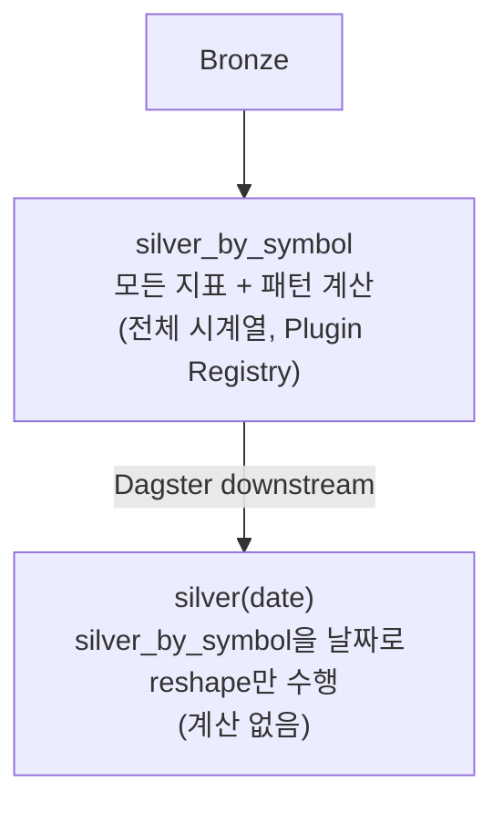

# 지표/패턴 Plugin Registry 아키텍처

> 작성일: 2026-06-17

---

## 배경

보조지표(EMA, RSI, MACD, BB 등) 외에 트레이딩 패턴(`big_brother`, `shooting_line`, EMA 조건 플래그 등)을
Silver Layer에 컬럼으로 추가하기로 결정했다.

단순히 `indicators_assets.py`에 하드코딩하면 지표가 늘어날수록 파일이 비대해지고,
새 지표를 추가할 때마다 파이프라인 코드를 수정해야 한다.

---

## 설계: Plugin Registry + Hybrid Polars

### 폴더 구조

```
indicators/
├── __init__.py          ← 자동 발견(pkgutil.walk_packages) + registry
├── base.py              ← @register_indicator / @register_pattern 데코레이터
├── numeric/             ← 수치형 지표 (EMA, RSI, MACD, BB, volume 등)
│   ├── ema.py
│   ├── rsi.py
│   ├── macd.py
│   ├── bollinger.py
│   └── volume.py
└── patterns/            ← boolean 패턴 (조건 플래그, 신호)
    ├── ema_conditions.py
    ├── bb_conditions.py
    ├── big_brother.py
    └── shooting_line.py
```

**새 지표 추가 = 파일 하나 추가. 파이프라인 코드 수정 불필요.**

---

### 두 가지 모드 (Hybrid)

Polars는 `pl.Expr`(표현식)을 `with_columns()`로 배치 실행할 때 가장 빠르다.
그러나 `big_brother`, `shooting_line`처럼 전체 시계열에 걸친 복잡한 패턴은
단일 Expr로 표현할 수 없어 DataFrame 전체 접근이 필요하다.

| 모드 | 반환 타입 | 대상 | 실행 방식 |
|---|---|---|---|
| `expr` | `pl.Expr` | EMA, RSI, MACD, BB, 단순 조건 | `with_columns([...])` 배치 — Polars 최적화 적용 |
| `series` | `pl.Series` | big_brother, shooting_line 등 | 순차 실행, df 전체 접근 가능 |

```python
# numeric/ema.py — expr 모드
@register_indicator(name="ema_448", priority=10, mode="expr")
def compute_ema448() -> pl.Expr:
    return pl.col("close").ewm_mean(span=448).alias("ema_448")

# patterns/ema_conditions.py — expr 모드 (단순 조건)
@register_pattern(name="cond_ema448_ge_ema224", priority=23, mode="expr",
                  requires=["ema_224", "ema_448"])
def cond_ema448_ge_ema224() -> pl.Expr:
    return (pl.col("ema_448") >= pl.col("ema_224")).alias("cond_ema448_ge_ema224")

# patterns/big_brother.py — series 모드 (복잡한 패턴)
@register_pattern(name="sig_big_brother", priority=120, mode="series",
                  requires=["ema_112", "ema_224", "ema_448"])
def compute_big_brother(df: pl.DataFrame) -> pl.Series:
    # 전체 시계열 접근 필요
    ...
    return pl.Series("sig_big_brother", result_bool_list)
```

### 파이프라인 실행 로직

```python
def compute_all(df: pl.DataFrame) -> pl.DataFrame:
    plugins = sorted(_REGISTRY, key=lambda p: p.priority)

    # 1단계: expr 모드 배치 실행 (Polars 최적화)
    exprs = [p.fn() for p in plugins if p.mode == "expr"]
    df = df.with_columns(exprs)

    # 2단계: series 모드 순차 실행 (requires 충족 보장됨)
    for p in [p for p in plugins if p.mode == "series"]:
        df = df.with_columns(p.fn(df))

    return df
```

---

## 파이프라인 순서: silver_by_symbol 먼저, silver(date)는 다운스트림

### 변경 전 (현재)

```
Bronze → silver_by_symbol  (지표 계산 — 심볼 전체 시계열)
Bronze → silver(date)      (지표 계산 — 날짜별 독립 계산, 중복)
```

`big_brother`, `shooting_line`은 날짜 단위로는 계산 불가 — 과거 전체 시계열이 필요하기 때문.

### 변경 후 (목표)



**이점:**
- 지표/패턴 로직이 한 곳에만 존재 (중복 제거)
- `big_brother`, `shooting_line`이 날짜 파티션에도 자연스럽게 포함됨
- `silver(date)` 코드는 reshape 로직만 유지

---

## Parquet 컬럼 추가 비용 분석 — 현재 규모에서의 판단

### Parquet의 특성

Parquet은 columnar immutable 포맷이다. 컬럼 추가 시 **파일 전체 재작성**이 필요하다.
JSON처럼 기존 row에 key를 append하는 방식이 불가능하다.

| | Parquet | JSON |
|---|---|---|
| 컬럼 추가 | 전체 파일 재작성 | key 하나 추가 (schema-less) |
| 특정 컬럼 읽기 | 해당 컬럼만 I/O | 전체 파싱 필요 |
| 압축률 | 높음 | 낮음 |

### 왜 우리 규모에서는 문제가 안 되는가

**비용 발생 시점**: backfill (배치, 1회성)
**이득 발생 시점**: 스크리닝/백테스트 (매번, 반복적)

새 지표를 추가할 때 어차피 과거 OHLCV를 다시 읽어 재계산해야 한다.
Parquet이든 JSON이든 "전체 재작성"은 피할 수 없다 — Parquet이 특별히 불리하지 않다.

`silver_by_symbol`은 **심볼 1개 = 파일 1개** 구조이므로 선택적 재계산도 용이하다.

```sql
-- 스크리닝: 3만+ 심볼 × 500일 데이터에서 big_brother 켜진 것만
SELECT symbol, date FROM silver
WHERE sig_big_brother = true AND date = '2026-06-17'
-- Parquet: sig_big_brother 컬럼만 읽음 (columnar I/O)
-- JSON: 모든 필드 파싱 후 필터
```

### 컬럼 추가 프로세스

```
1. indicators/patterns/ 에 새 파일 추가 (@register_pattern)
2. silver_by_symbol 전체 backfill 실행  ← Parquet 재작성 발생 (1회)
3. silver(date) 전체 backfill 실행      ← reshape만, 비용 거의 없음
4. 이후 daily 파이프라인은 자동으로 신규 컬럼 포함
```

### 구버전 파일 처리 (backfill 전)

DuckDB는 `union_by_name=true`를 이미 사용 중이므로,
backfill 전 구버전 파일은 새 컬럼이 자동으로 `NULL`로 읽힌다.
쿼리는 즉시 가능하되, 과거 데이터의 신규 컬럼값이 NULL인 상태.

### 만약 규모가 커진다면

현재 규모(KRX ~4,100 + NASDAQ ~3,900 심볼)에서는 backfill 비용이 허용 가능하다.
심볼 수가 수십만 단위로 늘거나 컬럼 추가가 매우 잦아지면
**Apache Iceberg** 도입을 고려한다 — 컬럼 추가가 메타데이터 변경만으로 O(1)이 된다.
현재는 오버엔지니어링.

---

## 컬럼 분류 정리

### 수치형 지표 (expr 모드)

| 컬럼명 | 설명 | 추가 필요 여부 |
|---|---|---|
| `ema_5/20/33/112/224/448` | 지수이동평균 | ema_112/224/448 추가 필요 |
| `rsi` | RSI(14) | 있음 |
| `macd`, `macd_signal` | MACD | 있음 |
| `bb_upper/lower` | 볼린저(20) | 있음 |
| `bb40_upper/lower` | 볼린저(40) | 추가 필요 |
| `avg_volume_5` | 5일 평균 거래량 | 추가 필요 |
| `avg_trading_amount_5` | 5일 평균 거래대금 | 추가 필요 |

### boolean 조건 플래그 (expr 모드)

| 컬럼명 | 조건 |
|---|---|
| `cond_ema20_gt_60` | EMA20 > 60 |
| `cond_close_ge_ema5` | 종가 ≥ EMA5 |
| `cond_ema448_gt_close` | EMA448 > 종가 |
| `cond_ema448_ge_ema224` | EMA448 ≥ EMA224 |
| `cond_bb40_upper_near` | 볼린저(40) 상단 근접 |

### 패턴 신호 (series 모드 — 전체 시계열 필요)

| 컬럼명 | 설명 |
|---|---|
| `sig_big_brother` | Big Brother arrow 발생 여부 |
| `sig_shooting_line` | Shooting Line 돌파 신호 |

---

## 관련 문서

- [`docs/silver-symbol-query-performance.md`](silver-symbol-query-performance.md) — 이중 파티션 설계 근거
- [`docs/ARCHITECTURE.md`](ARCHITECTURE.md) — 전체 시스템 구조
