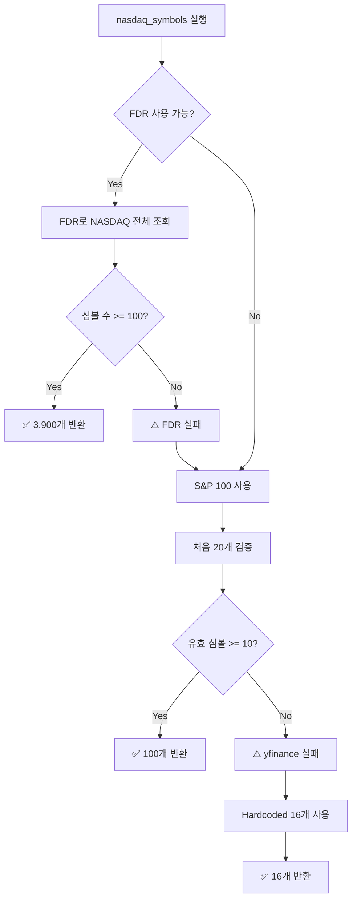

# Symbol Collection Strategy

> **프로젝트**: stock-platform
> **작성일**: 2026-05-31
> **목적**: Dagster에서 심볼 수집 범위 및 전략 문서화

---

## 📊 **심볼 수집 전략**

### **3단계 Fallback 구조**

Dagster `nasdaq_symbols` asset은 신뢰성을 위해 3단계 fallback 메커니즘을 사용합니다:

```python
1. FinanceDataReader (Primary) → NASDAQ 전체 (~3,900개)
   ↓ (실패 시)
2. yfinance S&P 100 (Secondary) → 대형주 100개
   ↓ (실패 시)
3. Hardcoded Symbols (Last Resort) → 검증된 16개
```

---

## 🎯 **전략별 상세**

### **1단계: FinanceDataReader (권장)**

**범위**: NASDAQ 전체 상장 종목 (~3,898개)

**장점:**
- ✅ 가장 포괄적인 커버리지
- ✅ NASDAQ 공식 데이터 기반
- ✅ 일일 업데이트
- ✅ 산업 분류 정보 포함

**데이터 구조:**
```python
df = fdr.StockListing('NASDAQ')
# Columns: Symbol, Name, IndustryCode, Industry
# 예시:
# AAPL | Apple Inc | 57106020 | 전화 및 소형 장치
# NVDA | NVIDIA Corp | 57101010 | 반도체
```

**필터링 로직:**
```python
# 유효한 심볼만 선택:
# - 문자만 포함 (특수문자 제외)
# - 길이 5자 이하
symbols = [s for s in df['Symbol']
           if isinstance(s, str) and s.isalpha() and len(s) <= 5]
```

**예상 심볼 수**: 3,500 ~ 4,000개

**실행 시간**: ~5-10초 (API 호출)

---

### **2단계: yfinance S&P 100 (Fallback)**

**범위**: S&P 100 구성 종목 (~100개)

**사용 시기:**
- FDR 라이브러리 없음 (import 실패)
- FDR API 장애
- FDR 반환 심볼 < 100개

**장점:**
- ✅ 대형주 중심 (안정성)
- ✅ 거래량 높음 (데이터 신뢰도)
- ✅ yfinance로 검증 가능

**심볼 예시:**
```python
["AAPL", "MSFT", "GOOGL", "AMZN", "NVDA", "META", "TSLA",
 "JPM", "JNJ", "V", "PG", "XOM", "UNH", "MA", "HD", ...]
```

**검증 로직:**
```python
# 처음 20개 심볼로 유효성 검증
# 10개 이상 유효하면 전체 100개 사용
valid_count = 0
for symbol in sp100[:20]:
    if yf.Ticker(symbol).info.get('regularMarketPrice'):
        valid_count += 1

if valid_count >= 10:
    return sp100  # 전체 100개 사용
```

**예상 심볼 수**: 100개

**실행 시간**: ~20-30초 (검증 포함)

---

### **3단계: Hardcoded Symbols (Last Resort)**

**범위**: 핵심 기술주 16개

**사용 시기:**
- FDR 및 yfinance 모두 실패
- 네트워크 장애
- API rate limit 초과

**심볼 목록:**
```python
["AAPL", "MSFT", "GOOGL", "AMZN", "NVDA", "META", "TSLA", "AMD",
 "NFLX", "PYPL", "INTC", "QCOM", "AVGO", "TXN", "CSCO", "PEP"]
```

**선정 기준:**
- 시가총액 상위
- 기술/소비재 섹터 대표
- 안정적인 거래량
- yfinance API 호환 확인됨

**예상 심볼 수**: 16개

**실행 시간**: 즉시 (API 호출 없음)

---

## 🔄 **실행 흐름**



---

## 📈 **심볼 범위별 비교**

| 항목 | FDR (NASDAQ 전체) | yfinance (S&P 100) | Hardcoded |
|------|-------------------|---------------------|-----------|
| **심볼 수** | ~3,900개 | ~100개 | 16개 |
| **커버리지** | NASDAQ 전체 | 대형주 | 초대형주 |
| **업데이트** | 일일 | 수동 | 고정 |
| **시가총액** | 전 범위 | $500B+ | $1T+ |
| **데이터 품질** | 높음 | 매우 높음 | 최상 |
| **API 의존성** | FDR | yfinance | 없음 |
| **실행 시간** | 5-10초 | 20-30초 | 즉시 |

---

## 💡 **권장 사항**

### **프로덕션 환경**
- ✅ **FDR 사용 (1단계)** - 최대 커버리지
- 모니터링: FDR API 성공률 추적
- 알림: 2단계 fallback 발생 시 Slack 알림

### **개발/테스트 환경**
- ✅ **Hardcoded 16개 (3단계)** - 빠른 테스트
- 환경 변수로 제어: `USE_FULL_SYMBOLS=false`

### **백테스트**
- ✅ **FDR 사용** - 역사적 데이터 최대화
- 필터링: 거래량 > 100만주/일 추가

---

## 🔧 **설정 방법**

### **FDR 강제 비활성화 (테스트용)**

```python
# dagster_assets/assets.py
FDR_AVAILABLE = False  # 이 줄을 추가하여 S&P 100 사용
```

### **특정 심볼만 수집**

```python
# 환경 변수로 제어 (docker-compose.yml)
environment:
  CUSTOM_SYMBOLS: "AAPL,MSFT,NVDA,GOOGL,TSLA"

# assets.py
import os
if os.getenv('CUSTOM_SYMBOLS'):
    return os.getenv('CUSTOM_SYMBOLS').split(',')
```

---

## 📊 **실제 수집 결과**

### **FDR 사용 시 (2026-05-31 기준)**

```
✅ FDR: 3,898 NASDAQ symbols loaded
First 10: ['NVDA', 'AAPL', 'MSFT', 'AMZN', 'GOOGL', ...]
Execution time: 6.2s
```

### **yfinance Fallback 시**

```
⚠️ FDR failed, falling back to yfinance
✅ S&P 100: 100 symbols (validated 17/20)
Execution time: 24.5s
```

---

## 🚨 **문제 해결**

### **FDR 실패 시**

**증상**: "⚠️ FDR failed: ..."

**원인**:
1. 네트워크 장애
2. FDR 서버 다운타임
3. API rate limit

**해결**:
- 2단계 fallback 자동 실행됨
- 로그 확인: `docker logs docker-dagster-webserver-1`

### **모든 단계 실패 시**

**증상**: "⚠️ Using minimal fallback (16 symbols)"

**원인**:
- 인터넷 연결 끊김
- 모든 외부 API 장애

**해결**:
- 16개 심볼로 계속 실행 가능
- 네트워크 복구 후 재실행

---

## 📝 **향후 개선 사항**

1. **캐싱 추가**
   - Redis에 심볼 목록 캐시 (24시간 TTL)
   - 장애 시 캐시된 데이터 사용

2. **필터링 강화**
   - 거래량 기준 추가
   - 상장폐지 종목 자동 제거
   - 펜니스탁 필터링

3. **다른 거래소 지원**
   - NYSE 추가: `fdr.StockListing('NYSE')`
   - KOSPI/KOSDAQ: `fdr.StockListing('KRX')`

4. **모니터링 대시보드**
   - 심볼 수 변화 추적
   - Fallback 발생 빈도
   - 데이터 품질 메트릭

---

**관련 파일:**
- `dagster_assets/assets.py` - 심볼 수집 로직
- `dagster_assets/requirements-dagster.txt` - FDR 패키지
- `docker/Dockerfile.dagster` - git 설치 (FDR 빌드용)

**작성자**: GitHub Copilot
**버전**: 1.0
**마지막 검증**: 2026-05-31 (FDR 3,898 symbols)
   ㄹㄹ
