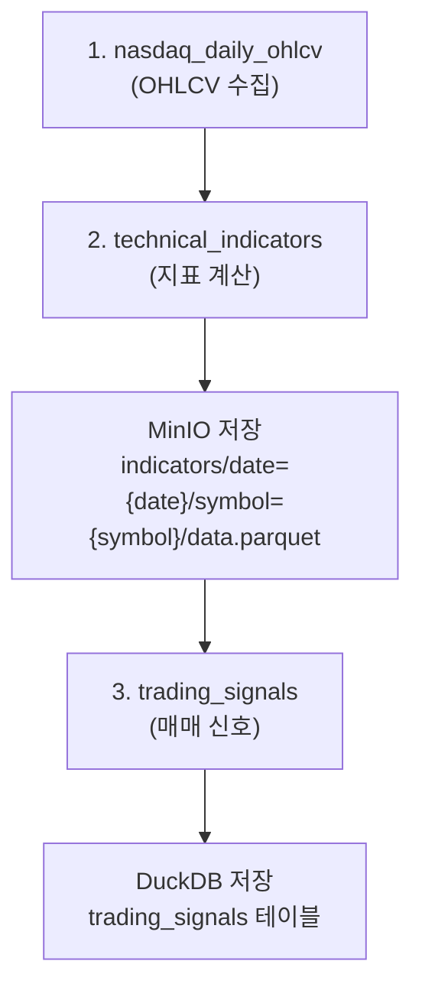

# 기술적 지표 Dagster 마이그레이션

## 📋 개요

stockpipeline의 기술적 지표 계산 로직을 stock-platform의 Dagster asset으로 마이그레이션했습니다.

## 🔄 마이그레이션 내용

### 1. 신규 파일

#### `common/indicators.py`
기술적 지표 계산 유틸리티 모듈

**구현된 함수:**
- `calculate_sma()` - 단순이동평균 (5, 20, 50, 60일)
- `calculate_ema()` - 지수이동평균 (5, 12, 20, 26, 60, 112, 224, 448일)
- `calculate_rsi()` - RSI (14일)
- `calculate_macd()` - MACD (12, 26, 9일)
- `calculate_bollinger_bands()` - 볼린저 밴드 (20일, 40일)
- `calculate_volume_sma()` - 거래량 이동평균 (20일)
- `calculate_blue_line()` - Blue Line (27일)
- `calculate_disparities()` - 이격도
- `calculate_obv()` - OBV (On-Balance Volume)
- `calculate_cci()` - CCI (Commodity Channel Index, 20일)
- `calculate_all_indicators()` - 모든 지표 일괄 계산

### 2. 업데이트된 파일

#### `dagster_assets/assets.py`
**신규 Asset 추가:**

##### `technical_indicators` Asset
- **의존성:** `nasdaq_daily_ohlcv`
- **기능:**
  - 각 심볼별로 과거 500일 데이터 로드 (MinIO)
  - 모든 기술적 지표 계산
  - MinIO에 결과 저장 (`indicators/date=YYYY-MM-DD/symbol=AAPL/data.parquet`)
  - 최신 날짜 데이터만 반환

##### `trading_signals` Asset (업데이트)
- **의존성:** `technical_indicators` (변경됨)
- **기능:**
  - RSI, MACD, EMA 기반 매수/매도 신호 생성
  - 신호 점수 계산 (0.0 ~ 1.0)
  - DuckDB에 결과 저장

**신규 함수:**
- `load_historical_data_from_minio()` - 과거 데이터 로드
- `save_indicators_to_minio()` - 지표 MinIO 저장
- `save_signals_to_duckdb()` - 신호 DuckDB 저장

#### `common/duckdb_client.py`
**신규 테이블 스키마:**

```sql
CREATE TABLE technical_indicators (
    symbol, date, 
    open, high, low, close, volume,
    sma_5, sma_20, sma_50, sma_60,
    ema_5, ema_12, ema_20, ema_26, ema_60, ema_112, ema_224, ema_448,
    macd, macd_signal, macd_histogram,
    rsi,
    bb_upper, bb_middle, bb_lower,
    bb40_upper, bb40_middle, bb40_lower,
    volume_sma_20, blue_line, obv, cci,
    disparity_sma20, disparity_ema12,
    PRIMARY KEY (symbol, date)
);
```

## 🔄 데이터 플로우



## 📊 지표 목록

### 이동평균선
- **SMA:** 5일, 20일, 50일, 60일
- **EMA:** 5일, 12일, 20일, 26일, 60일, 112일, 224일, 448일
- **별칭:** `sma` (sma_20), `ma_112/224/448` (ema_112/224/448)

### 추세/모멘텀 지표
- **MACD:** 12일-26일 EMA, 9일 신호선, 히스토그램
- **RSI:** 14일 상대강도지수
- **CCI:** 20일 상품채널지수

### 변동성 지표
- **Bollinger Bands (20일):** 중심선, 상단, 하단 (2σ)
- **Bollinger Bands (40일):** 중심선, 상단, 하단 (2σ)
- **Blue Line:** EMA(27) + 2.5 * std(typical price)

### 거래량 지표
- **OBV:** On-Balance Volume (누적 거래량)
- **Volume SMA:** 거래량 20일 이동평균

### 기타
- **이격도:** SMA20, EMA12 기준

## 🎯 거래 신호 생성 로직

### 매수(BUY) 신호
- RSI < 30 (과매도) → +0.3점
- MACD > Signal (상승 추세) → +0.2~0.3점
- EMA12 > EMA26 (단기 > 장기) → +0.2점

### 매도(SELL) 신호
- RSI > 70 (과매수) → +0.3점
- MACD < Signal (하락 추세) → +0.2~0.3점
- EMA12 < EMA26 (단기 < 장기) → +0.2점

### 관망(HOLD) 신호
- 매수/매도 조건 미충족

**최종 점수:** 0.0 ~ 1.0 (높을수록 강한 신호)

## 🚀 실행 방법

### 1. Dagster 실행
```bash
cd stock-platform/dagster_assets
dagster dev
```

### 2. Dagster UI
- 브라우저: `http://localhost:3000`
- **Assets 탭**에서 확인:
  - `nasdaq_symbols` → `nasdaq_daily_ohlcv` → `technical_indicators` → `trading_signals`

### 3. 특정 날짜 실행
Dagster UI에서:
1. `technical_indicators` asset 선택
2. **Materialize** 버튼 클릭
3. **Partition** 선택 (예: 2024-12-01)
4. 실행

### 4. 결과 확인

#### MinIO (지표 데이터)
```
bucket: stock-data
path: indicators/date=2024-12-01/symbol=AAPL/data.parquet
```

#### DuckDB (거래 신호)
```python
from common.duckdb_client import get_connection

with get_connection() as conn:
    df = conn.execute("""
        SELECT * FROM trading_signals
        WHERE date(created_at) = '2024-12-01'
        ORDER BY score DESC
        LIMIT 10
    """).fetchdf()
    print(df)
```

## 🔧 커스터마이징

### 지표 추가
`common/indicators.py`에 새로운 함수 추가:

```python
def calculate_stochastic(df: pd.DataFrame, period: int = 14) -> pd.DataFrame:
    """스토캐스틱 계산"""
    df = df.copy()
    high = df['high'].rolling(period).max()
    low = df['low'].rolling(period).min()
    df['stoch_k'] = 100 * (df['close'] - low) / (high - low)
    df['stoch_d'] = df['stoch_k'].rolling(3).mean()
    return df
```

`calculate_all_indicators()`에 추가:
```python
df = calculate_stochastic(df, period=14)
```

### 신호 로직 수정
`dagster_assets/assets.py`의 `trading_signals` asset 수정

## 📝 주의사항

1. **최소 데이터 요구사항:** 지표 계산을 위해 최소 20일 이상의 과거 데이터 필요
2. **메모리 사용:** 각 심볼당 500일치 데이터 로드 (약 1-2MB)
3. **저장 공간:** MinIO에 날짜별/심볼별로 Parquet 파일 저장
4. **파티션 처리:** 날짜별 파티션으로 관리되며, 재실행 시 idempotent

## 🔍 트러블슈팅

### 지표 계산 실패
- 과거 데이터가 부족한 경우 (< 20일)
- MinIO 연결 실패
- 데이터 타입 오류

**해결:**
```python
# 로그 확인
context.log.info(f"Data length: {len(historical_df)}")
```

### MinIO 데이터 누락
- OHLCV 데이터가 먼저 수집되어야 함
- 주말/휴장일에는 데이터 없음

**확인:**
```bash
mc ls minio/stock-data/ohlcv/date=2024-12-01/
```

## 🎓 참고

- **원본 코드:** `stockpipeline/common/technical_indicator_calculator_spark.py`
- **Dagster 문서:** https://docs.dagster.io/
- **기술적 지표 설명:** `stockpipeline/docs/adding-new-indicator.md`
