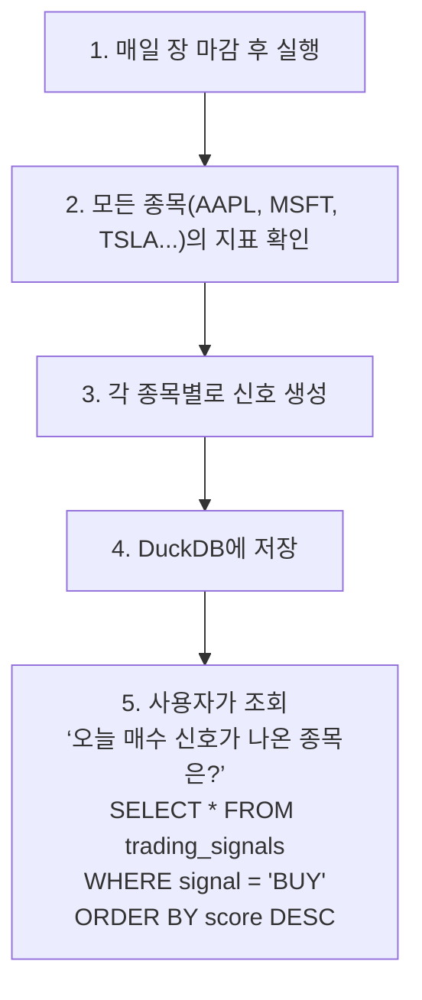

# Trading Signals 상세 설명

## 🎯 Trading Signals란?

**"이 주식을 사야 할까, 팔아야 할까, 아니면 기다려야 할까?"**를 자동으로 판단해주는 신호입니다.

---

## 🔍 신호 종류

1. **BUY (매수)** - 지금 사는 게 좋을 것 같다
2. **SELL (매도)** - 지금 파는 게 좋을 것 같다
3. **HOLD (관망)** - 아무것도 하지 않고 기다리자

각 신호에는 **점수(0.0~1.0)**가 함께 제공됩니다.
- 0.0 = 확신 없음
- 1.0 = 매우 강한 신호

---

## 📊 어떻게 판단할까?

### 1. **RSI (과매수/과매도) 체크**

```python
if RSI < 30:
    → BUY 신호 (+0.3점)
    이유: 너무 많이 팔렸다 → 곧 반등할 가능성

elif RSI > 70:
    → SELL 신호 (+0.3점)
    이유: 너무 많이 샀다 → 곧 하락할 가능성
```

**예시:**
- AAPL의 RSI가 25 → **BUY 신호** (과매도 상태)
- TSLA의 RSI가 75 → **SELL 신호** (과매수 상태)

---

### 2. **MACD (추세 변화) 체크**

```python
if MACD > Signal Line:
    → BUY 방향 (+0.2~0.3점)
    이유: 상승 추세 시작 (골든크로스)

elif MACD < Signal Line:
    → SELL 방향 (+0.2~0.3점)
    이유: 하락 추세 시작 (데드크로스)
```

**예시:**
- MACD가 Signal을 위로 돌파 → **상승 추세** (매수 유리)
- MACD가 Signal 아래로 내려감 → **하락 추세** (매도 유리)

---

### 3. **EMA (단기/장기 이동평균) 체크**

```python
if EMA12 > EMA26:
    → BUY 방향 (+0.2점)
    이유: 단기 상승세가 장기보다 강함

elif EMA12 < EMA26:
    → SELL 방향 (+0.2점)
    이유: 단기 하락세
```

**예시:**
- 12일 평균이 26일 평균보다 위 → **상승세** 유지 중

---

## 💡 실제 예시

### 예시 1: 강한 매수 신호
```
종목: AAPL
날짜: 2024-12-01
현재가: $150.00

지표 분석:
- RSI = 25  → 과매도! (+0.3점)
- MACD > Signal → 상승 전환! (+0.3점)
- EMA12 > EMA26 → 상승 추세! (+0.2점)

결과:
→ 신호: BUY
→ 점수: 0.8 (강한 매수)
→ 의미: 지금 사기 좋은 타이밍!
```

---

### 예시 2: 강한 매도 신호
```
종목: TSLA
날짜: 2024-12-01
현재가: $200.00

지표 분석:
- RSI = 78  → 과매수! (+0.3점)
- MACD < Signal → 하락 전환! (+0.3점)
- EMA12 < EMA26 → 하락 추세! (+0.2점)

결과:
→ 신호: SELL
→ 점수: 0.8 (강한 매도)
→ 의미: 지금 팔기 좋은 타이밍!
```

---

### 예시 3: 관망 신호
```
종목: MSFT
날짜: 2024-12-01
현재가: $380.00

지표 분석:
- RSI = 50  → 중립 (점수 없음)
- MACD ≈ Signal → 추세 불분명
- EMA12 ≈ EMA26 → 횡보

결과:
→ 신호: HOLD
→ 점수: 0.0 (확신 없음)
→ 의미: 기다리자, 아직 명확하지 않음
```

---

## 📈 실제 사용 흐름



---

## 🔍 신호 조회 예시

### 가장 강한 매수 신호 찾기
```sql
SELECT symbol, signal, score, rsi, macd
FROM trading_signals
WHERE signal = 'BUY' 
  AND date(created_at) = '2024-12-01'
ORDER BY score DESC
LIMIT 10;
```

**결과:**
```
symbol | signal | score | rsi  | macd
-------|--------|-------|------|------
AAPL   | BUY    | 0.8   | 25.3 | 1.2
NVDA   | BUY    | 0.7   | 28.1 | 0.8
AMD    | BUY    | 0.5   | 45.0 | 0.3
```

---

## ⚠️ 주의사항

1. **이건 참고용입니다!**
   - 100% 정확하지 않음
   - 실제 투자 결정은 본인이 해야 함

2. **신호 강도를 확인하세요**
   - score 0.7 이상: 강한 신호
   - score 0.3~0.7: 중간 신호
   - score 0.3 미만: 약한 신호

3. **다른 정보도 함께 보세요**
   - 뉴스, 실적, 거시경제 등

---

## 🎓 요약

**Trading Signals = 자동 매매 타이밍 추천 시스템**

- RSI, MACD, EMA를 분석해서
- "사라(BUY)", "팔아라(SELL)", "기다려라(HOLD)" 신호를 생성
- 각 신호의 강도(점수)도 함께 제공
- 매일 자동으로 계산되어 DuckDB에 저장됨

**→ 투자 결정을 도와주는 보조 도구입니다! 🚀**
