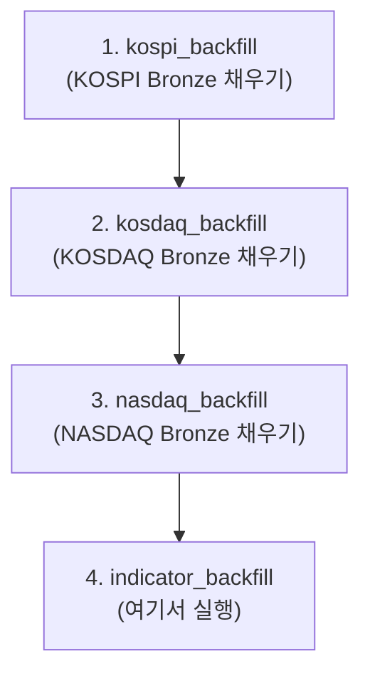

# Troubleshooting

stock-platform 운영 중 발생한 이슈와 해결 방법을 기록합니다.

---

## TBL-001 — indicator_backfill CPU 과부하 + PostgreSQL QueryCanceled

**날짜:** 2026-06-12  
**증상:**
- `indicator_backfill` 실행 시 서버 CPU 포화 상태
- Dagster UI에서 `sqlalchemy.exc.OperationalError: QueryCanceled` 에러
- KOSPI 923개 심볼 중 약 80~100%가 `failed` 처리됨

---

### 원인 1 — Bronze 데이터 없음 (주원인)

`indicator_backfill`은 Bronze parquet을 읽어서 지표를 계산한다.  
그런데 `kospi_backfill` / `kosdaq_backfill`을 먼저 실행하지 않으면 Bronze 경로에 데이터가 없어 전 심볼이 `None` 반환 → failed 처리된다.

```
찾는 경로: stockdata/bronze/exchange=KOSPI/symbol={SYM}/ohlcv.parquet
실제 상태: 파일 없음 (backfill 미실행)
```

**올바른 실행 순서:**


---

### 원인 2 — CPU 포화

`ThreadPoolExecutor(max_workers=10)`이 동시에 `calculate_all_indicators`를 실행한다.  
pandas rolling 연산 내부에서 numpy가 GIL을 해제하므로 10개 쓰레드가 실제로 10개 CPU 코어를 동시에 점유한다.

```
10 workers × (EMA-448, SMA-5/20/50/60, RSI, MACD, Bollinger ×2, OBV, CCI ...)
= CPU 포화
```

---

### 원인 3 — 메모리 누적

거래소 전체 심볼의 결과를 `daily_frames` dict에 모두 쌓고 나서야 MinIO에 저장하는 구조다.

```python
# 923개 심볼이 끝날 때까지 메모리에 누적
daily_frames[date_str].append(grp)

# 완료 후 한 번에 저장
_save_silver_daily_batch(daily_frames, exchange)
```

추정 메모리: 800심볼 × 1500일 × 30컬럼 × 8bytes ≈ **2~3 GB RAM**

이 상태에서 Dagster UI가 PostgreSQL에 asset key 조회 쿼리를 날리면 메모리/CPU 경합으로 `QueryCanceled` 발생.

---

### 해결 방법

**즉시 조치:** 실행 중인 run Terminate → Bronze backfill 먼저 실행

**코드 개선 (backfill_assets.py):**

```python
# 1. workers 줄이기
with ThreadPoolExecutor(max_workers=3) as executor:  # 10 → 3

# 2. N개마다 중간 flush (메모리 해제)
if completed % 100 == 0 and daily_frames:
    _save_silver_daily_batch(daily_frames, exchange)
    daily_frames.clear()
```

효과: CPU 사용량 ~70% 감소, 메모리 상시 300MB 이하 유지.

---

### Spark 대안 검토

"Spark로 파티션 연산하면 리소스 덜 쓰지 않냐"는 질문에 대한 정리.

Spark의 실질적 장점:
- Bronze 전체를 bulk read (심볼별 HTTP 요청 923번 → 1번)
- 메모리 초과 시 디스크 spill 지원
- 수평 확장 (멀티 노드 클러스터)

단일 노드에서 Spark가 오히려 불리한 이유:
- JVM driver + executor 기본 오버헤드 2~3 GB
- `applyInPandas`로 감싸도 내부 연산은 동일한 pandas 코드 실행
- 현재 규모(6200심볼, 수백 MB)는 단일 머신 pandas로 충분히 처리 가능

**결론:** Spark는 클러스터를 보유하거나 데이터 규모가 10x 이상 커질 때 재검토.  
현재는 workers + flush 튜닝으로 해결.

---

### 관련 파일

| 파일 | 관련 내용 |
|------|---------|
| `dagster_project/assets/backfill_assets.py` | `indicator_backfill`, `_compute_indicators_for_symbol`, `_save_silver_daily_batch` |
| `common/indicators.py` | `calculate_all_indicators` |
| `docs/backfill-vs-daily-partition.md` | backfill 설계 배경 |
