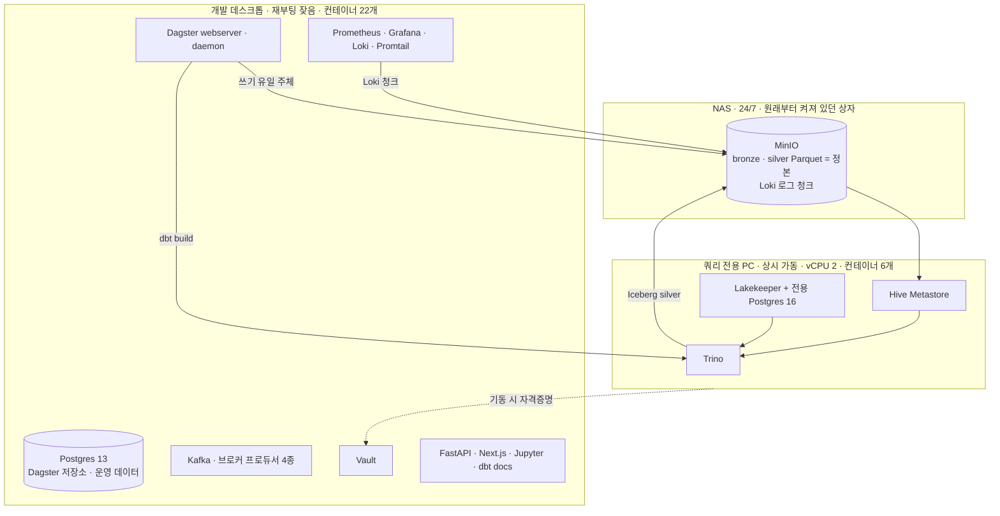

## 한눈에 보기

- 문제: 클라우드를 쓰지 않기로 하면 "무슨 기술을 쓸까"보다 "무엇을 어느 상자에 둘까"가 먼저 걸린다. 집에 있는 장비는 개발용 데스크톱 한 대, 여분 PC 한 대, NAS 한 대가 전부였다.
- 제약: 데이터가 앉을 자리는 24/7이어야 하는데 개발 데스크톱은 재부팅이 잦다. 그리고 쿼리 엔진을 보낸 여분 PC는 **vCPU가 2개**다.
- 선택: 가용성이 필요한 것(정본 데이터)은 NAS로, 간섭받으면 안 되는 것(쿼리 엔진)은 여분 PC로, 나머지 전부는 데스크톱으로 나눴다. 분할선은 "역할"이 아니라 **의존성 경계**로 그었다.
- 결과: 데스크톱 22개 / 쿼리 PC 6개 컨테이너로 운영 중. 코어 2개짜리 쿼리 서버에서 단일 종목 조회 1.07초, 전체 dbt build 838초가 나온다.
- 핵심 교훈: 스택 목록만 보면 이 플랫폼이 왜 이 모양인지 알 수 없다. 설명력은 남은 것이 아니라 **버린 것**에 있다.

## 클라우드를 안 쓰면 배치가 첫 설계 문제가 된다

이 프로젝트는 KRX와 NASDAQ 전 종목의 일봉을 매일 수집해 지표를 계산하고 스크리닝·백테스팅·매매 신호에 쓰는 개인 데이터 플랫폼이다. 매니지드 서비스를 쓰면 배치는 고민거리가 아니다. 스토리지는 S3, 쿼리는 Athena, 오케스트레이션은 MWAA — 각 컴포넌트가 어느 물리 상자에서 도는지 알 필요가 없다.

집에 있는 장비로 하면 그 추상화가 사라진다. 컴포넌트마다 CPU를 나눠 쓰고, 디스크를 나눠 쓰고, 한 상자가 재부팅되면 그 위의 모든 것이 같이 내려간다. 그래서 기술 스택을 정하기 전에 "무엇을 어느 상자에 둘 것인가"부터 답해야 했고, 이 배치가 이후의 기술 선택을 대부분 규정했다.

가진 것은 세 개였다.

- 개발용 데스크톱 — 코드를 짜는 상자. 성능은 셋 중 가장 낫지만 재부팅이 잦다.
- 여분 PC 한 대 — 놀고 있던 저사양 머신.
- 시놀로지 NAS — 이미 24시간 켜져 있고 디스크가 있다.

## 세 상자를 나눈 기준

| 상자 | 실측 사양 | 무엇이 도는가 | 배치 근거 |
|---|---|---|---|
| NAS | Synology, MinIO 20TB | MinIO (데이터레이크 버킷 + 로그 버킷) | 유일하게 원래부터 24/7. 정본이 앉을 자리 |
| 개발 데스크톱 | i7-7700 4C/8T, RAM 31GiB, 디스크 915GB(사용 9%), Ubuntu 24.04 LTS | 컨테이너 22개 — 오케스트레이션·스트리밍·시크릿·서비스·관측 | 나머지 전부. 성능이 가장 낫고 코드가 여기 있다 |
| 쿼리 전용 PC | **vCPU 2개**, RAM 31GiB, 디스크 195GB | 컨테이너 6개 — Trino·Hive Metastore·Lakekeeper·전용 Postgres·exporter 2종 | 데스크톱 재부팅·리소스 경합과 무관하게 상시 가동돼야 하는 것 |

점선 하나가 이 배치의 약점을 그대로 보여준다. 쿼리 PC 스택은 기동할 때 데스크톱의 Vault에서 MinIO 자격증명을 받아야 한다. Vault까지 함께 옮기면 Raft 스냅샷 이관과 재-unseal 절차가 붙어서 이관 범위가 커지고, MinIO를 이미 LAN 너머로 참조해온 전례가 있어 같은 패턴을 택했다. 대신 "데스크톱이 죽어도 쿼리는 산다"는 목표에 예외가 하나 생겼다 — 이미 떠 있는 쿼리 스택은 계속 돌지만, 그 상태에서 쿼리 PC를 재기동하면 데스크톱이 살아날 때까지 카탈로그 설정이 렌더링되지 않는다.

### 왜 Trino를 NAS에 올리지 않았나

스토리지와 컴퓨트를 같은 상자에 두면 네트워크 왕복이 사라진다. 실제로 검토했고, 두 가지 이유로 접었다.

첫째, NAS는 이미 자기 한계를 드러낸 상태였다. 대량 LIST와 동시 연결에서 반복적으로 타임아웃과 Connection refused가 났고, 그 한계가 저장 레이아웃 설계를 계속 규정하고 있었다([[시놀로지 NAS와 MinIO로 만든 데이터 레이크]]). 그 위에 JVM 쿼리 엔진의 대량 스캔을 얹는 것은 이미 병목인 지점에 부하를 더하는 일이다.

둘째, 더 중요하게는 **정본이 앉은 상자에는 실패해도 되는 워크로드를 올리지 않는다**는 원칙이었다. 쿼리는 실패해도 다시 던지면 된다. 정본은 그렇지 않다. 둘을 같은 상자에 두면 쿼리 하나가 스토리지 가용성을 위협할 수 있다.

대가는 명확하다. 모든 스캔이 LAN을 탄다. 이건 이 배치가 감수한 상시 비용이고, 뒤에서 다시 적는다.

### 코어 2개짜리 쿼리 서버

가장 설명이 필요한 배치가 이것이다. 쿼리 엔진을 셋 중 가장 느린 상자에 보냈다.

이유는 성능이 아니라 **uptime**이었다. 레이크하우스 도입 시점에 Trino와 Lakekeeper 체인은 데스크톱에 있었는데, 코드를 고치고 컨테이너를 재기동할 때마다 쿼리 엔진이 같이 흔들렸다. 쿼리 엔진은 상시 켜져 있어야 하고 개발 머신은 그럴 수 없다. 그래서 산 것은 코어가 아니라 "개발 활동과 격리된 상시 가동"이었다.

이관 범위를 정하면서 배운 게 하나 더 있다. 처음 계획은 "Trino만" 옮기는 것이었는데, 실제로는 불가능했다. Trino의 두 카탈로그가 요구하는 의존성이 갈렸기 때문이다 — bronze를 읽는 Hive 카탈로그는 Vault와 MinIO 접근만 있으면 되지만, silver를 쓰는 Iceberg 카탈로그는 Lakekeeper 체인 전체가 필요하다. 배치의 최소 단위는 컨테이너가 아니라 **의존성이 닫히는 묶음**이었다. 이관 경위는 [[사라지는 산출물 - dbt와 Trino Iceberg 레이크하우스]]에 있다.

그래서 코어 2개로 무엇이 되고 무엇이 안 되는가. 이 상자 위에서 나온 실측치가 답을 준다.

- 단일 종목 point lookup: **104.2초 → 1.07초**. 같은 하드웨어에서 97배가 좁혀졌다. 코어를 늘려서가 아니라 파티션 메타데이터 조회 구조를 고쳐서 나온 숫자다([[쿼리 한 번에 104초 - 작은 파일 8만 개와의 싸움]]).
- 전체 dbt build: **838초** (KRX 644만 행 314초 + NASDAQ 1,205만 행 520초).

전자는 코어 수에 거의 무관했고, 후자는 정직하게 비례한다. 스캔 대상을 메타데이터로 좁힐 수 있는 조회는 저사양 상자에서도 성립하고, 전 종목을 훑는 배치는 코어가 곧 시간이다. 지금은 838초가 야간 배치 창 안에 넉넉히 들어와서 문제가 아니지만, 이건 "충분하다"가 아니라 "아직 부딪히지 않았다"에 가깝다.

## 스택 전수 — 무엇이 어디서 도는가

각 선택의 근거는 해당 편에 있으므로 여기서는 배치와 한 줄 근거만 적는다.

### 개발 데스크톱

| 역할 | 프로그램 | 고른 이유 (상세는 링크) |
|---|---|---|
| 오케스트레이션 | Dagster (webserver + daemon) | 추적 대상이 "작업이 돌았나"가 아니라 "데이터가 최신인가"였고, dbt manifest를 asset 그래프로 흡수한다 — [[Airflow가 아니라 Dagster를 선택한 이유]] |
| 메타데이터·운영 DB | PostgreSQL 13 | Dagster의 run/event_log/schedule 저장소가 여러 프로세스의 공유 상태이자 원자적 조율 지점이라 객체 스토리지로 대체 불가 |
| 스트림 버스 | Kafka 7.4.0 (KRaft, ZooKeeper 없음) | 증권사 프로듀서 4종과 소비자들을 느슨하게 잇는 유일한 상시 채널. 보존은 24시간/512MB 캡 |
| Kafka 운영 UI | kafka-ui | 토픽·컨슈머 그룹 확인용 |
| 실시간 캐시 | Redis 7 (maxmemory 2GB, allkeys-lru) | 당일 시세의 휘발성 계층. 유실돼도 정본에서 복원 가능한 데이터만 둔다 |
| 브로커 수집 | 프로듀서 4종 (KIS · 키움 · LS · 토스) | 브로커마다 하드캡이 달라 한 계정으로 전 종목을 감당할 수 없다 — [[실시간은 관심종목만 - Spark 없는 람다 아키텍처]] |
| 시크릿 | HashiCorp Vault 1.17 (Prod 모드 + Raft) | 실거래 API 키에는 저장소가 아니라 런타임 갱신 경로가 필요했다 — [[Vault와 대시보드 0개 - 1인 플랫폼의 운영]] |
| 임시 조회 | Jupyter + DuckDB | SQL 한 줄 쳐보는 마찰을 없애는 용도. 저장소 역할은 주지 않는다 — [[DuckDB는 저장소가 아니라 조회 엔진이다]] |
| SQL 변환 | dbt (온디맨드 실행) | 상시 구동이 아니라 `run --rm`으로 그때만 뜬다. Gold 마트가 dbt의 자리다 — [[재귀 지표는 SQL로 풀 수 없다 - 실버 레이어가 Python에 남은 이유]] |
| dbt 문서 | nginx (정적 서빙) | dbt가 만든 `target/` 디렉토리를 그대로 서빙. 문서 서버를 따로 만들 이유가 없었다 |
| API 서버 | FastAPI | 프런트엔드가 same-origin 프록시로 도커 네트워크 안에서 붙으므로 호스트 포트를 노출하지 않는다 |
| 프런트엔드 | Next.js | 스크리닝·차트 화면 |
| 지표 계산 | Python + Polars (라이브러리) | EMA 재귀와 절차형 패턴 지표가 SQL로 표현되지 않는다 |
| 수집 소스 | FinanceDataReader, yfinance (라이브러리) | KRX 심볼·일봉과 NASDAQ 이력의 소스가 갈린다 |
| 관측 | Prometheus 2.54 · Grafana 11.2 · Loki 3.1 · Promtail 3.1 · node-exporter · cAdvisor | 메트릭과 로그를 같은 시간축에서 보기 위한 최소 조합 |

### 쿼리 전용 PC

| 역할 | 프로그램 | 고른 이유 |
|---|---|---|
| 쿼리 엔진 | Trino 476 | dbt-trino 어댑터와 Iceberg 커넥터가 있고, bronze는 Hive 커넥터로 zero-copy 노출된다 |
| Hive 메타스토어 | Apache Hive Metastore (Thrift) | 문서화되지 않은 file metastore 구성이 파티션 메타데이터 병목의 원인이었다 |
| Iceberg 카탈로그 | Lakekeeper 0.12 (REST catalog) | dbt가 만든 silver 테이블의 스냅샷·커밋 관리 |
| 카탈로그 DB | PostgreSQL 16 (전용) | Lakekeeper가 PG15+ 문법을 요구하는데 운영 Postgres는 13이었다. 공유 인프라의 버전 요구가 갈리면 억지로 합치지 않는다 |
| 메트릭 노출 | node-exporter · cAdvisor | Prometheus/Grafana는 데스크톱에만 두고 여기는 exporter만 — 관측 스택을 이중 배포하지 않는다 |

Postgres가 두 벌인 것도, 그래서 두 상자에 나뉘어 있는 것도 설계라기보다 버전 제약의 결과다.

### 정의돼 있지만 지금은 안 도는 것

compose에 서비스로 있는데 내려가 있는 것이 5개다 — 신호 엔진, 주문 실행기, 그리고 Kafka 컨슈머 3종(MinIO·Postgres·Redis). 실시간 계층이 아직 설계 단계이기 때문이고, 기존 배선을 감사했을 때 죽은 토픽을 구독하던 컨슈머가 나온 이력도 있다([[실시간은 관심종목만 - Spark 없는 람다 아키텍처]]).

반대로 compose에 없는데 떠 있는 컨테이너도 하나 있다. 메타스토어를 검증하려고 띄웠다가 치우지 않은 테스트 컨테이너다. 22개 중 하나는 그냥 남아 있는 것이라는 뜻이다.

이미지 태그도 완전히 정리되지는 않았다. Trino·Grafana·Loki·Prometheus·Vault·Lakekeeper처럼 패치 버전까지 박은 것이 있는가 하면, Postgres와 Redis는 메이저 버전까지만이고, kafka-ui는 `latest`, dbt 문서 서빙용 nginx는 `alpine`이다. 스토리지 이미지를 고를 때 "latest 태그가 있다"와 "유지보수되고 있다"는 다른 문제라는 걸 이미 한 번 확인했으므로([[시놀로지 NAS와 MinIO로 만든 데이터 레이크]]) 이건 갚아야 할 부채다.

## 버린 선택지들

리포를 처음 여는 사람은 여기서 혼란을 겪는다. `airflow/dags/` 아래 DAG 파일 3개, `Dockerfile.airflow`, `requirements-airflow.txt`가 그대로 있는데 어느 compose에도 Airflow 서비스가 없다. 레이크하우스 이전 구성을 담은 legacy compose 파일도, compose 백업 파일도 남아 있다.

이런 화석이 남아 있는 게 이 총론이 필요한 이유다. 현재 스택 목록만으로는 이 플랫폼이 왜 이 모양인지 설명되지 않는다.

| 버린 선택지 | 검토 시점 | 기각 근거 | 상세 |
|---|---|---|---|
| Airflow | 오케스트레이터 선정 | 추적 단위가 task가 아니라 데이터 상태였고, dbt를 검은 상자 task로 만들지 않으려면 asset 모델이 필요했다 | [[Airflow가 아니라 Dagster를 선택한 이유]] |
| Spark | 3회 (백필 성능 / 분봉 설계 / 요구사항 인터뷰) | 마지막에 "전 종목 실시간"이 요구사항이 아님이 확인되며 정당화 규모 자체가 사라졌다 | [[실시간은 관심종목만 - Spark 없는 람다 아키텍처]] |
| DuckDB를 저장소로 | 파일 락 사고 직후 | 단일 writer 전제 — 노트북이 파일을 잡으면 배치가 죽는다 | [[DuckDB는 저장소가 아니라 조회 엔진이다]] |
| duckdb-ui | 원격 조회 시도 | secure-origin 제약으로 localhost 전용, LAN에서 못 연다 | 같은 글 |
| Presto | 레이크하우스 엔진 선정 | 문서와 dbt 연동 기준으로 Trino 쪽이 표준 | [[사라지는 산출물 - dbt와 Trino Iceberg 레이크하우스]] |
| bronze를 Iceberg로 복사 | 도입 다음 날 번복 | 정본이 이미 안전한 레이어에 Iceberg의 durability 보증이 불필요했다 | 같은 글 |
| dbt-SQL 실버 | 지표 이관 실험 후 | EMA 재귀와 패턴 지표의 절차성이 SQL로 표현 불가 + 그 테이블의 소비자가 0 | [[재귀 지표는 SQL로 풀 수 없다 - 실버 레이어가 Python에 남은 이유]] |
| Trino `WITH RECURSIVE` | 위 실험 중 | experimental이고 기본 재귀 깊이가 시계열 길이에 못 미친다 | 같은 글 |
| JSON 스키마리스 저장 | 지표 확장 PoC | 결국 모든 행에 키를 채워야 해서 재작성 비용이 고정 컬럼과 같았다 | 같은 글 |
| year 파티션 유지 | 소파일 대응 | 방어 근거였던 부분 쓰기 손상이 오브젝트 스토리지에서는 성립하지 않았다 | [[쿼리 한 번에 104초 - 작은 파일 8만 개와의 싸움]] |
| `append`/`overwrite` 이중 쓰기 API | 데이터 유실 사고 후 | 잘못 고를 수 있는 선택지 자체를 제거했다 | [[overwrite 한 번에 사라진 수년치 데이터]] |
| GitHub Secrets · Vault Dev 모드 | 시크릿 설계 | 배포 시점 주입 모델이라 상시 구동 앱에 안 맞고, Dev 모드는 재시작 시 소실 | [[Vault와 대시보드 0개 - 1인 플랫폼의 운영]] |
| 대신증권 연동 | 브로커 확장 중 | REST API 미제공이 확인돼 만들던 연동 일체를 드랍했다 | 같은 글 |
| MongoDB (로그 저장소) | 2026-08 | 아래 | — |
| 로그 파이프라인 앞단의 Kafka | 2026-08 | 아래 | — |

### MongoDB 대신 MinIO — 결정력 순으로

로그를 어디에 쌓을지 정해야 했을 때 MongoDB가 후보로 올라왔다. 문서형 DB고, 스키마가 제각각인 로그를 그대로 받아준다. 기각했고, 근거를 결정력 순으로 적으면 이렇다.

**첫째, Grafana OSS는 MongoDB 데이터소스를 읽지 못한다.** 이게 다른 모든 근거보다 결정적이었다. MongoDB 데이터소스는 Enterprise 전용 플러그인이다. 이미 대시보드와 알림과 Explore가 전부 Grafana 위에 올라가 있는데 로그만 그 생태계 밖으로 떨어지면, "CPU가 튄 그 시각에 어떤 로그가 찍혔나"를 같은 시간축에서 대조할 수 없게 된다. 단품 성능 비교로는 절대 보이지 않는 항목이었다.

**둘째, 저장 구조가 로그에 안 맞는다.** 로그는 append-only에 시간 범위로 조회한다. Loki는 라벨만 인덱싱하고 본문은 압축 청크로 둔다. Mongo는 문서마다 BSON 오버헤드와 `_id` 인덱스가 기본으로 붙고, 필드로 검색하려면 인덱스가 데이터보다 커지기 쉽다.

**셋째, 삭제 비용이 다르다.** Loki compactor는 만료된 청크를 객체 단위로 통째 지운다. Mongo의 TTL 인덱스는 문서 단위 백그라운드 삭제라 쓰기 부하와 단편화가 상시 발생한다.

**넷째, 문제가 원위치로 돌아온다.** Mongo는 블록 스토리지를 요구해서 MinIO 위에 올릴 수 없다. 로컬 디스크가 찰까 봐 로그를 NAS로 뺐는데 로그 저장소가 도로 로컬 볼륨에 쌓이는 모양이 된다.

**다섯째, 운영 대상이 하나 늘어난다.** stateful 서비스가 다섯 번째가 된다. 관측을 하겠다고 관측 대상을 늘리는 셈이다.

공평하게 적자면 Mongo가 맞는 자리도 있다. 필드로 조회할 **구조화 레코드** — 체결 감사기록이나 브로커 API 원문 보관 같은 것. 그런데 그건 로그가 아니라 애플리케이션 데이터고, 이 플랫폼에는 이미 Postgres가 그 자리에 있다.

한 가지 분명히 해둘 것은 **메모리가 이유가 아니었다**는 점이다. 데스크톱은 31GB 중 20GB 이상이 놀고 있어서 Mongo는 충분히 뜬다. 기각 사유는 용량이 아니라 위의 다섯 개다. 그리고 MinIO에 객체로 두면 나중에 같은 파일을 Iceberg 테이블로 재처리해 Trino로 SQL 분석할 수 있다는 옵션 가치가 덤으로 남는다.

### 로그 파이프라인 앞에 Kafka를 두는 안

Kafka가 이미 떠 있으니 로그도 Kafka로 받아서 버퍼링하자는 안도 검토했다. 기각했다. 전체 로그가 하루 150MB 규모, 초당 2KB가 안 되는 흐름이라 버퍼가 해결할 문제가 없다. 더 나쁘게는 **순환 의존**이 생긴다. 그 150MB 중 90MB, 약 60%를 만드는 게 Kafka와 그 관리 UI다. 로그 최다 생산자가 자기 로그의 운반자까지 겸하면, Kafka가 아플 때 그 사실을 알려줄 경로도 같이 아프다.

### 기각에서 반복된 네 가지 패턴

목록을 놓고 보면 기각 사유가 네 종류로 갈린다.

**규모 미달** — Spark와 로그용 Kafka가 여기다. 둘 다 도구가 나쁜 게 아니라 정당해지는 최소 규모가 있고 우리가 그 밑에 있었다. 이 유형은 기각할 때 "언제 재검토하는가"를 숫자로 적어두면 다음 검토가 싸진다. Spark는 실제로 그 조건("데이터 10배") 때문에 두 번째 검토를 받았다.

**유통기한이 지난 기각 근거** — Hive 커넥터를 "문서에 없는 방식"이라며 배제했던 판단은 틀렸고, 그 잘못된 배제가 bronze를 매일 복사하는 아키텍처를 만들 뻔했다. 기각 사유도 재검증 대상이다.

**생태계 이탈 비용** — MongoDB 건이 순수한 사례다. 저장 엔진의 성능만 비교하면 답이 안 나오고, "이미 쓰고 있는 도구가 그걸 읽을 수 있는가"가 1순위 근거였다.

**선택지 자체를 제거** — 쓰기 API의 `mode` 파라미터를 없앤 것, DuckDB에 "조회 엔진"이라는 역할을 못 박은 것. 1인 운영에서는 조심하는 것이 안전장치가 될 수 없어서, 실수할 수 있는 경로를 구조적으로 지우는 쪽을 택했다.

## 이 배치가 감수한 것

정직하게 적으면 이 구성의 약점은 전부 "상자가 세 개뿐"이라는 데서 나온다.

**데스크톱이 단일 장애점이다.** 오케스트레이션·스트리밍·시크릿·관측이 전부 한 상자에 있다. 그 상자가 내려가면 NAS의 정본은 살아남지만 수집은 멈추고, 관측 스택도 같이 죽어서 무엇이 멈췄는지 볼 화면도 사라진다. 관측을 관측 대상과 같은 상자에 둔 것은 구조적으로 틀렸지만, 세 번째 상자를 쓸 수 없었다.

**부팅마다 수동 개입이 남아 있다.** Vault는 재시작할 때마다 수동 unseal이 필요하다.

**compose 파일이 호스트별로 갈리면서 조작 실수가 사고가 됐다.** 데스크톱에만 데이터플레인용과 관측용 compose 두 개가 있는데, 같은 프로젝트 이름을 공유해서 한쪽만 로드해 `up`을 실행하면 다른 쪽 컨테이너가 orphan으로 잡히고 무관한 서비스(Postgres·Kafka·Vault)까지 연쇄로 내려간다. 2026-08-01에 두 번 재현됐고 둘 다 실제 서비스 다운과 Vault 재실링으로 이어졌다. 지금은 항상 두 파일을 함께 로드하는 것으로 대응하고 있지만, 이건 규율이지 안전장치가 아니다. 위에 적은 "선택지를 제거한다" 원칙을 아직 적용하지 못한 자리다.

**쿼리 PC의 컨테이너 로그는 수집되지 않는다.** Promtail이 데스크톱의 도커 소켓만 보기 때문이다. 쿼리 PC에서 오는 건 메트릭뿐이라, 정작 쿼리가 실패했을 때 그 이유를 중앙에서 볼 수 없다. 배치를 나눈 대가를 관측이 아직 따라잡지 못한 상태다.

**모든 스캔이 LAN을 탄다.** 스토리지·컴퓨트 분리를 택한 이상 이건 상시 비용이다.

**이중화가 0이다.** 각 역할이 상자 하나씩이고, 어느 것도 대체할 상자가 없다.

## 다시 배치한다면

세 가지가 다르다.

**관측을 관측 대상 밖으로 뺀다.** 지금은 데스크톱이 죽으면 알림도 같이 죽는다. 상자가 하나 더 있다면 그게 첫 번째 용도다.

**Vault를 쿼리 PC 쪽 의존에서 끊는다.** Raft 스냅샷 이관 비용이 아까워 미뤘는데, 그 결과 "데스크톱과 독립적으로 상시 가동"이라는 이관 목표에 예외가 하나 남았다.

**코어 수 대신 배치 창을 먼저 잰다.** 쿼리 PC를 업그레이드할지는 838초가 야간 창을 넘길 때 판단할 문제다. 지금 코어를 늘리는 건 부딪히지 않은 병목에 돈을 쓰는 일이고, 이 프로젝트에서 계측 없이 고쳤던 것은 전부 헛발이었다.

## 정리

집에 있는 장비로 플랫폼을 만들면 세 가지가 자연스럽게 드러난다. 첫째, 배치가 기술 선택보다 먼저다 — 무엇을 어느 상자에 둘지가 정해져야 그 위에서 무엇이 성립하는지 알 수 있다. 둘째, 저사양이라고 못 하는 게 아니라 못 하는 종류가 정해진다 — 코어 2개짜리 상자에서 point lookup 1.07초는 되고 전 종목 배치는 838초가 걸린다. 셋째, 스택 목록은 결과일 뿐이고 설명은 버린 선택지에 있다.

각 결정의 실측치와 실패 과정은 위에 링크한 아홉 편에 흩어져 있다. 이 글은 그것들이 왜 하나의 모양으로 수렴했는지에 대한 지도다.
